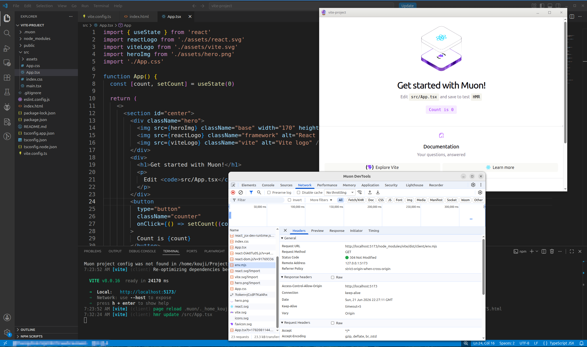

# muon

A multi-platform GUI application framework that uses CEF as its backend.

---

[(For Japanese language/日本語はこちら)](./README_ja.md)

> Please note that this English version of the document was machine-translated and then partially edited, so it may contain inaccuracies.
> We welcome pull requests to correct any errors in the text.

## What is This?

WIP: This project is still in a very early prototype phase.
I intend to complete it, but please note that it is not yet at the stage of active implementation.

Have you ever thought about how to update an outdated native GUI application into a modern one?
Replacing applications is extremely complex and has always been a challenge for us.

Since the causes are so varied, there is no "magic solution" that promises, "Use this method, and it'll be easily solved!"
Even so, everyone wants to modernize their applications at the lowest possible cost.

muon (/ˈmjuːɒn/) is a multiplatform GUI application framework that uses CEF (Chromium Embedded Framework).
You’ve probably heard of several similar projects, such as [Electron](https://www.electronjs.org/).

To put it simply, muon is a framework that occupies the same niche as those projects.
In other words, it’s software that allows you to implement locally running GUI applications as web applications.

With muon, you can build native applications using the most advanced and widely used browser-based UI frameworks, such as React and Vue.

So, how does muon differ from earlier framework solutions?

It specializes in GUI application development within a local environment by using a whitelist approach (with a "deny-by-default" policy)
for accessing external web resources.

You might think, "It's a waste to use CEF without being able to access websites around the world!"
However, I believe that is precisely the biggest problem with existing solutions—they've become extremely complex and difficult to manage.

Furthermore, muon isn't completely unable to access external resources; since it uses a whitelist approach,
you can still access permitted websites.

It also features a plugin system that supports fully asynchronous processing, enabling interoperability with native libraries.
Since these features become available based on pre-configured settings, there's no risk of unused functionality running unchecked.

Since it's CEF-based, you can naturally use features expected in Chromium, such as WebGL, WebGPU, WebAssembly, Web Workers, and Local Storage.
You can also display Chromium DevTools. Because it supports CDP (Chrome DevTools Protocol), you can debug using tools like VS Code or connect and control it via Playwright.
You can also use remote DevTools from Chromium/Chrome via `chrome://inspect/`.

In short, by clearly eliminating one of the major issues that arise when migrating native GTK/Qt/Windows applications to web applications,
you can develop modern local GUI applications using the web-based technology ecosystem.

### Features

- By restricting all network access with a whitelist filter, you can completely block problematic content.
- It is provided as an easy-to-use NPM package, allowing you to easily turn your web application project into a native GUI application.
  No complex configuration or modifications are required.
- The browser responsible for rendering is CEF (Chromium Embedded Framework).
  This means that, from the perspective of your web application, it is virtually equivalent to using Chromium or Chrome.
- Supports Vite plugins (optional). With support for Vite’s HMR, you can update previews in real time during development.
- Provides `muon dev` for launching local development assets directly without starting an HTTP server.
- You can use Chromium DevTools. Furthermore, because it supports CDP (Chromium DevTools Protocol), you can perform remote debugging from an external source.
- You can display multiple browser windows. Browser windows can also be organized into a parent-child hierarchy.
- It features a plugin system. Additionally, plugin functionality can be restricted using a whitelist filter.
- Using built-in plugins, you can access local files, open dialogs, launch child processes, and manipulate windows.

### Environment

- Supports the following architectures among those supported by the official CEF binaries:
  - Linux: amd64, armv7l, arm64
  - Windows: i686, amd64
- Build Environment
  - Node.js 20 or later
  - Vite 5 or later (optional)

---

TODO:

---

## License

Under MIT.
