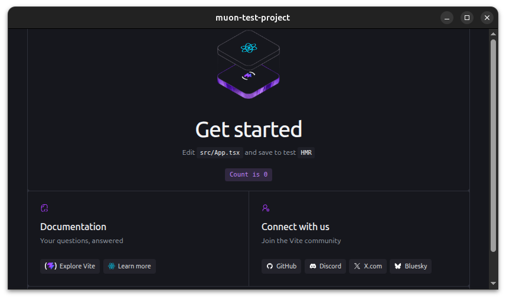
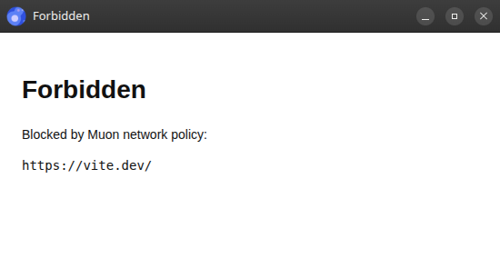
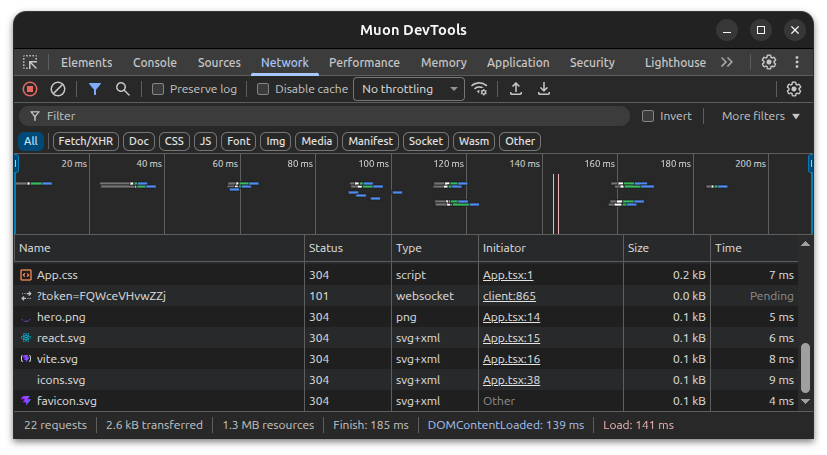

# muon

A multi-platform GUI application framework that uses CEF as its backend.


[](https://www.repostatus.org/#wip)
[](https://opensource.org/licenses/MIT)
[](https://www.npmjs.com/package/muon-ui)

---

[(For Japanese language/日本語はこちら)](./README_ja.md)

> Please note that this English version of the document was machine-translated and then partially edited, so it may contain inaccuracies.
> We welcome pull requests to correct any errors in the text.

## What is this?

Have you ever wanted to update an aging native GUI application into a modern application?
Application replacement is extremely complex, and it has always been a hard problem.

The causes vary widely, so there is no magic solution that makes everything easy.
Even so, everyone wants to modernize with as little cost as possible.

muon (pronounced "muon") is a multi-platform GUI application framework that uses CEF (Chromium Embedded Framework).
You have probably heard of similar projects such as [Electron](https://www.electronjs.org/).

Roughly speaking, muon is framework software in the same category.
In other words, it lets you implement local GUI applications as web applications.

With muon, you can build native applications using the most mature and widely used browser UI frameworks, such as React and Vue.


So how is muon different from earlier framework software?

muon specializes in local GUI application development by using a whitelist approach for access to external web resources.
In practice, access is denied by default.

You may think that using CEF without access to websites around the world is a waste.
However, we believe that this is the biggest reason existing solutions have become very complex and difficult to handle.

muon also does not completely forbid access to external resources.
Because the policy is whitelist-based, permitted websites remain accessible.

muon also includes a plugin system with fully asynchronous processing for interoperability with native libraries.
These features are enabled from explicit configuration, so unused capabilities are not left open.

Because muon is based on CEF, Chromium features such as WebGL, WebGPU, WebAssembly, Web workers, and Local storage are available as expected.
DevTools can be shown. CDP (Chrome DevTools Protocol) is also available, so you can debug with VS Code, connect Playwright, or control the app externally.
You can also use remote DevTools from Chromium/Chrome through `chrome://inspect/`.

In short, muon clearly removes one of the major problems that appears when migrating GTK/Qt/Windows native applications to web applications.
This lets you build modern local GUI applications with the web technology ecosystem.

muon also minimizes the steps required to create a muon application, keeping the barrier to entry low.
With the minimal setup, installing the NPM package and adding one line to the configuration file is enough to launch your first muon app.

### Features

- Restricts all network access through a whitelist filter, letting you completely exclude problematic content.
- Provided as an easy-to-use NPM package, so you can turn your web application project into a native GUI application without complex configuration or changes.
- The rendering browser is CEF (Chromium Embedded Framework). From the web application's point of view, this is almost the same as using Chromium or Chrome.
- Supports the Vite plugin system. It also supports Vite HMR, so previews update in real time during development.
- Supports Linux (deb) and Windows (NSIS) package generation, and portable distribution.
- DevTools can be used. CDP (Chrome DevTools Protocol) is also supported, so remote debugging from external tools is possible.
- Includes a plugin system. Plugin capabilities can also be restricted by a whitelist filter.
- Built-in plugins provide access to local files, open dialogs, child process launching, and window operations.

### Environment

- Supports the following architectures from the official CEF binary architectures:
  - Linux: amd64, armhf, arm64
  - Windows: i686, amd64
- Build environment
  - Node.js 20 or later
  - Vite 5 or later

---

## Getting started with muon (Quick version)

Let's get started by creating an application with muon (a muon app).
Use a [Vite template](https://vite.dev/guide/) to create "my-muon-app" as you normally would:

```bash
npm create vite@latest my-muon-app -- --template react-ts
```

This example uses React + TypeScript, but of course other choices are fine. Be sure to enable TypeScript.
Then run:

```bash
cd my-muon-app
npm install
npm run dev
```

This starts the Vite development server, and you can click the link to view the page in a browser.

Now add muon to this project:

```bash
npm install -D muon-ui
```

The CEF binary itself is not included in the NPM package.
CEF is downloaded from the official CDN when it is needed.

Next, add the muon Vite plugin to Vite so that you can build your muon app. Add the following code to `vite.config.ts`:

```ts
import { defineConfig } from 'vite'
import react from '@vitejs/plugin-react'
import muon from 'muon-ui/vite'

export default defineConfig({
  plugins: [
    react(),  // React plugin
    muon(),   // muon plugin (add this)
  ],
})
```

Everything is now ready. Launch muon:

```bash
npm run dev
```

The muon window should appear with your page!



If you click a button such as "Explore Vite", a new window opens and shows the following disappointing page:



This is proof that one of muon's key features, the network access whitelist filter, is working. Access to content on other sites is blocked.

You can also launch muon DevTools with the `F12` key:



CDP (Chrome DevTools Protocol) is also enabled, so you can control the app with Playwright or debug it with VS Code (see the relevant chapter for details).

Packaging a muon app is also simple:

```bash
npx muon pack
```

This generates Linux and Windows packages (in deb and NSIS formats) in the `artifacts/` directory.

---

## Documentation

See the following documents for more detailed information about muon.

### User guides

- [Getting started with muon](./docs/en/getting-started.md)
- [CEF download and update](./docs/en/cef-download-and-update.md)
- [muon DevTools](./docs/en/muon-devtools.md)
- [Local asset configuration](./docs/en/local-assets.md)
- [Using muon plugins](./docs/en/muon-plugins.md)
- [Accessing external networks](./docs/en/external-network.md)

### Advanced topics

- [muon CLI](./docs/en/muon-cli-advanced-topics.md)
- [Package installation locations](./docs/en/package-install-location-advanced-topics.md)
- [CEF versions and CEF API versions](./docs/en/cef-version-and-cef-api-version-advanced-topics.md)
- [CEF binary update details](./docs/en/cef-binary-update-details-advanced-topics.md)
- [Window communication limitations](./docs/en/window-communication-limitations-advanced-topics.md)
- [Local asset permissions](./docs/en/local-asset-permissions-advanced-topics.md)
- [Local asset packing](./docs/en/local-asset-packing-advanced-topics.md)
- [Origin-based permissions](./docs/en/origin-based-permissions-advanced-topics.md)

### References

- [muon.json reference](./docs/en/muon-json-reference.md)
- [muon Vite plugin reference](./docs/en/muon-vite-plugin-reference.md)
- [muon built-in plugin reference](./docs/en/muon-built-in-plugin-reference.md)

### Implementing muon plugins

- [Developing muon plugins](./docs/en/muon-plugin-develop.md)

### Other

- [muon-ui self-build](./docs/en/muon-ui-self-build-advanced-topic.md)
- [Limitation](./docs/en/limitation.md)

---

## License

Under MIT.
