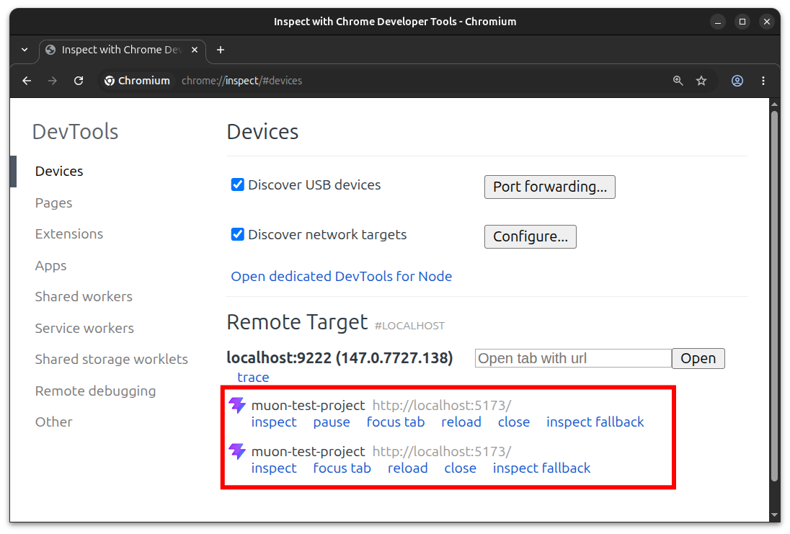
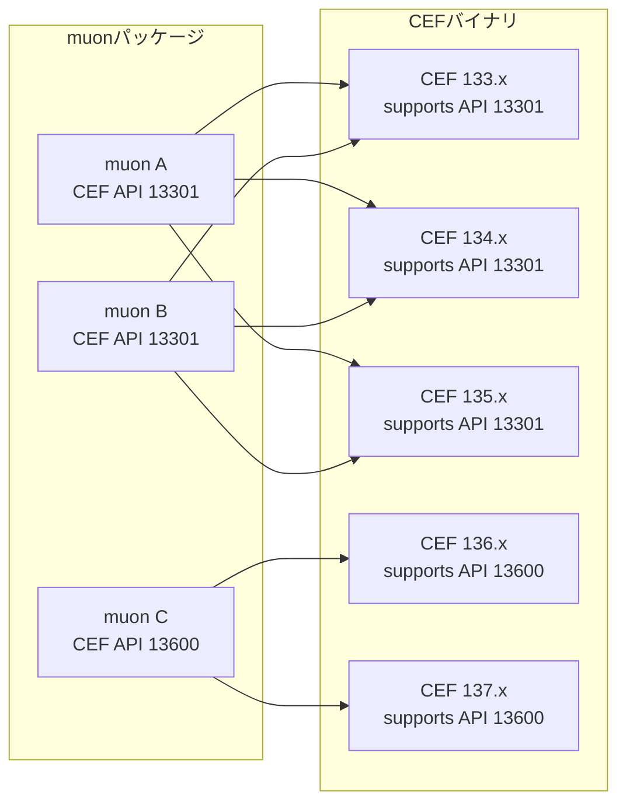

# muon

CEFをバックエンドで使用する、マルチプラットフォームGUIアプリケーション基盤


[](https://www.repostatus.org/#wip)
[](https://opensource.org/licenses/MIT)
[](https://www.npmjs.com/package/muon-ui)

---

[(English language is here)](./README.md)

## これは何?

WIP: このプロジェクトはまだ非常に初期の検証段階です。
私はこれを完成させるつもりで居ますが、本格的に検証を行う前の段階であることに注意して下さい。

あなたは、古くなってしまったネイティブGUIアプリケーションを、どうにかして最新のモダン化されたアプリケーションに更新したいと考えたことはありますか？
アプリケーションのリプレースメントは非常に複雑で、私達をいつも悩ませて来ました。

その原因は多岐に渡るため、「この手法を使えば簡単に解決する！」というような、魔法のソリューションは存在しません。
それでもなお、できるだけ低いコストで現代的に刷新したいとは、誰しもが考えることでしょう。

muon (ミューオン, /ˈmjuːɒn/) は、CEF (Chromium Embedded Framework) を使用する、マルチプラットフォームGUIアプリケーション基盤です。
あなたは恐らく、 [Electron](https://www.electronjs.org/) に代表される同種のプロジェクトをいくつか聞いたことがあるかもしれません。

乱暴に言えば、muonはそれらと同じポジションの基盤ソフトウェアです。
つまり、ローカルで動作するGUIアプリケーションを、ウェブアプリケーションとして実装出来るソフトウェアです。

muonを使用すれば、最も発達し、かつ最も使われているブラウザ環境のUIフレームワーク、例えばReactやVueを使用して、
ネイティブアプリケーションを作ることが出来ます。


では、muonは先発の基盤ソフトウェアとどう違うのでしょうか？

それは、外部のウェブリソースへのアクセスをホワイトリスト方式（基本的にdeny）とすることで、
ローカル環境でのGUIアプリケーション開発に特化しているということです。

CEFを使うのに、世界中のウェブサイトにアクセス出来ないのはもったいない！ と思うかもしれません。
ですが、既存のソリューションが非常に複雑で扱いづらくなっている最大の問題点はそこにあると考えています。

また、muonは外部リソースに全くアクセス出来ないわけではなく、あくまでホワイトリスト方式なので、
許可されたウェブサイトにはアクセス可能です。

そして、ネイティブライブラリとの相互運用を実現する、完全に非同期処理に対応したプラグインシステムも搭載しています。
これらも事前構成に基づいて使用可能になるため、使われない機能を野放しにすることはありません。

CEFベースなので、Chromiumで想定されるWebGL, WebGPU, WebAssembly, Web worker, Local storageなども当然使用できます。
Chromium DevToolsを表示させることも可能です。CDP (Chrome DevTools Protocol) も使用できるため、vscodeなどでデバッグしたり、playwrightを接続して操ることも可能です。
Chromium/chromeから、 `chrome://inspect/` でリモートDevToolsを使用することも可能です。

つまり、GTK/Qt/Windowsのネイティブアプリケーションをウェブアプリケーションに移行する際に発生する、大きな問題点の一つをわかりやすく除外することで、
ウェブベース技術のエコシステムを使って現代的なローカルGUIアプリケーションを開発出来ます。

### 特徴

- すべてのネットワークアクセスをホワイトリストフィルターで制限することで、問題を起こすコンテンツを完全に除外できます。
- 扱いやすいNPMパッケージとして提供され、あなたのウェブアプリケーションプロジェクトを簡単にネイティブGUIアプリケーション化できます。複雑な構成や変更は不要です。
- レンダリングを担うブラウザはCEF (Chromium Embedded Framework)です。つまり、ウェブアプリケーションから見た場合は、Chromiumやchromeを使用しているのとほぼ同等です。
- Viteプラグインに対応しています（オプション）。ViteのHMRに対応しているため、開発時にプレビューのリアルタイム更新を行えます。
- `muon dev` で、HTTPサーバーを起動せずにローカルアセットを直接使った開発起動ができます。
- Chromium DevToolsを使用できます。更にCDP (Chromium DevTools Protocol)に対応しているため、外部からリモートデバッグを行うことが出来ます。
- 複数のブラウザウインドウを表示できます。ブラウザウインドウは親子関係をもたせることも出来ます。
- プラグインシステムを備えています。また、プラグインの機能は、ホワイトリストフィルターで制限できます。
- 内蔵プラグインを使用して、ローカルファイルへのアクセス・オープンダイアログ・子プロセス起動・ウインドウ操作が可能です。

### 環境

- CEF公式バイナリの対応アーキテクチャのうち、下記のアーキテクチャに対応:
  - Linux: amd64, armhf, arm64
  - Windows: i686, amd64
- ビルド環境
  - Node.js 20以降
  - Vite 5以降（オプション）

---

## ユーザーガイド

早速muonでアプリケーション（muonアプリ）を作ってみましょう。

muonは開発体験を直交的なものに感じられるように、開発ライフサイクルとランタイムを可能な限り分離しています。
新規にアプリケーションを開発する場合だけでなく、既存のウェブアプリケーションをmuonアプリ化するために、
再現可能な最小の手順で実現出来るような開発ライフサイクルが重要だと考えています。

これを明らかにするため、まずは、ごく一般的なウェブアプリケーションプロジェクトを用意する事から始めましょう。
例えば、 [Viteのテンプレート](https://vite.dev/guide/) を使って、"my-muon-app" を作りましょう:

```bash
npm create vite@latest my-muon-app -- --template react-ts
```

ここではReact+TypeScriptを選択しましたが、もちろん他の選択肢でもOKです。
TypeScriptは使用したほうが良いでしょう。理由は後で説明します。

そして、以下のコマンドで必要なパッケージのインストールを行って、アプリケーションを実行します:

```bash
cd my-muon-app
npm install
npm run dev
```

これで、Viteの開発サーバーが起動するので、リンクをクリックしてブラウザでページを表示できます。
まだmuonは導入していません。素のViteプロジェクトです。

このプロジェクトにmuonを導入します。必要な作業は:

1. muonパッケージをインストール
2. muon Viteプラグインを構成

だけです。しかも、それぞれ非常に簡単です。

---

### muonパッケージをインストール

muonパッケージ(正式名: `muon-ui`)は、 `devDependencies` にインストールします:

```bash
npm install -D muon-ui
```

muonパッケージには、以下の要素を含みます:

- muon CLI
- muon Viteプラグイン
- muon内蔵プラグインのTypeScript型定義
- platform別のmuonバイナリアセット

CEF本体バイナリは、NPMパッケージに含まれません。

### muon Viteプラグインを構成

実はmuonパッケージを導入しただけでほぼ準備は整っていますが、このプロジェクトではViteを使っているので、
ぜひViteのHMR (Hot Module Replacement)を使用出来るようにすることをお勧めします。

HMRを知らない人に簡単に説明すると、開発中にViteが擬似的なサーバーとなって、ブラウザにページを表示可能にし、かつ、ページを編集した時にほぼリアルタイムで表示を更新してくれます。
つまり、編集結果を自動的にプレビュー表示する、非常に便利な機能です。

muonはHMRに対応していて、ブラウザの代わりにmuonを起動して、muonアプリ上でHMRを機能させます。
これを有効化するために、`vite.config.ts` に以下のコードを追加します:

```ts
import { defineConfig } from 'vite'
import react from '@vitejs/plugin-react'
import muon from 'muon-ui/vite'

export default defineConfig({
  plugins: [
    react(),  // Reactプラグイン
    muon(),   // muonプラグイン (追加する)
  ],
})
```

`defineConfig()` 引数の `plugins` 配列に、`muon()` を加えて下さい。これでmuonプラグインが有効化されます。これで準備は完了です!

いよいよmuonを起動します:

```bash
npm run dev
```

で、muonのウインドウとあなたのページが表示されるはずです!


ページのソースコードを変更して、ブラウザで表示させていた時と遜色なく、HMRが機能することを確認してみて下さい。

`npm run dev` でmuonを起動すると、`F12` キーでMuon DevToolsを起動でき、`Ctrl+F12` キーでmuonをリサイクル再起動できます。
また、CDP (Chromium DevTools Protocol) が有効化されるので、Playwrightで操作したりvscodeでデバッグが可能です（詳しくば別章を参照）。

### muon devで直接起動

Viteの開発サーバーを使わず、ローカルに生成済みのアセットディレクトリをそのままmuonで開きたい場合は、`muon dev` を使用できます。
`muon dev` はHTTPサーバーを起動せず、`asset.sourcePath` を開発用に上書きしてmuonをフォアグラウンド起動します。
そのため、ViteのHMRは動作しません。

```bash
muon dev
```

開発アセットは `--assets`、`muon.json` の `asset.sourcePath`、`assets/` の順に解決されます。
`--assets` はローカルディレクトリを指定し、相対パスはproject rootから解決されます。

`vite.config.*` にmuon Viteプラグインが1つだけ含まれている場合、`muon dev` は `muonPath`, `cefPath`, `stagePath`, `enableDebugger` を読み取ります。
CLIオプションで同じ項目を指定した場合はCLI側が優先され、`open` と `build` は `muon dev` では無視されます。
Muon DevTools、リサイクルキーバインド、CDPの開発用既定値を無効化するには `--no-debugger` を指定します。

---

### 配布用ビルド (Vite)

Vite muonプラグインを設定した状態で `vite build` を実行すると、Viteの通常ビルドに続いてmuon配布用ディレクトリも生成されます。

```bash
npm run build
```

Viteの `build.outDir` に出力されたファイル群は `assets.zip` にまとめられ、ZIP内では `asset://main/` として参照できるように `main/` プレフィックスが付きます。

既定ではインストール済みmuonパッケージが対応する全ターゲットをビルドし、`dist-muon-linux-amd64/` や `dist-muon-windows-amd64/` のようなターゲット別ディレクトリに出力されます。

ターゲットや出力先を細かく指定したい場合は、Viteプラグインの引数 `build` で指定できます:

```ts
import { defineConfig } from 'vite';
import muon from 'muon-ui/vite';

export default defineConfig({
  plugins: [
    muon({
      build: {  // ビルドオプションの指定
        targets: ['linux-amd64', 'windows-amd64'],
        outputRoot: 'release',
        appName: 'my-app',
        appId: 'com.example.my-app',
      },
    }),
  ],
});
```

既定では、アプリケーションの実行ファイル名は `package.json` の `name` から生成され、scope付きパッケージ名の場合はscopeを除いた名前を使用します。
実行時のstate領域を識別するapp idは同じ `name` から生成されますが、scopeを含めた安定IDとして扱うため、`@scope/name` は `scope.name` になります。

指定可能なターゲット名は、以下のとおりです:

- Linuxターゲット: `linux-amd64`, `linux-armhf`, `linux-arm64`
- Windowsターゲット: `windows-i686`, `windows-amd64`

### 配布用ビルドとパッケージ生成

配布用ビルドや配布用パッケージ生成は、 `muon` CLIからも実行できます。

`vite.config.*` にmuon Viteプラグインが含まれている場合、 `muon build` は `vite build` と同じビルドシーケンスを使用します。
つまり、Viteプラグインの `build` オプションを既定値として使い、Viteの `build.outDir` を `asset://main/` として配布用ディレクトリにまとめます。
同じ項目をCLIオプションで指定した場合はCLI側が優先されます。

```bash
npx muon build
```

muon Viteプラグインが無い場合、 `muon build` はコンテンツビルド用のnpm scriptや `vite build` を自動実行せず、既に存在するアセットを配布用ディレクトリにまとめます。
この場合のアセット元は、`--assets`、 `muon.json` の `asset.sourcePath`、 `assets/` の順に解決されます。
`asset.sourcePath` は設定ファイルが置かれているディレクトリからの相対パス、または絶対パスとして扱われます。
アセット元がディレクトリの場合は `assets.zip` にパッキングし、ZIPファイルの場合は配布先の `assets.zip` としてそのままコピーして署名します。

ターゲットを指定する場合は `--target linux-amd64` のように指定し、すべての同梱ターゲットを生成する場合は `--all` を使用します。
muon Viteプラグインが無い場合、 `muon build` の未指定ターゲットは実行中ホストのターゲットです。

配布用パッケージを生成する場合は、 `muon pack` コマンドを使用します。
`muon pack` は `muon build` と同じビルドシーケンスで配布用ディレクトリを生成してから、指定した形式にパッケージ化します。
muon Viteプラグインがある場合は `vite build` を実行し、その間はViteプラグイン側のmuon配布用ビルドを抑止してから、CLI側で1回だけmuon配布用ディレクトリを生成します。
muon Viteプラグインが無い場合は `vite build` を実行せず、既に存在するアセットを使用します。
その後、指定した形式ごとに `./artifacts/` へ最終配布物だけを出力します。
`deb` のパッケージツリーや `nsis` の `.nsi` スクリプトなど、パッケージ生成中の作業ファイルは `./.muon/pack/` 配下に生成されます。

```bash
npx muon pack
npx muon pack --type zip
npx muon pack --type nsis
npx muon pack --target windows
npx muon pack --target amd64
npx muon pack --type zip,deb --target linux-amd64
npx muon pack --type nsis --target windows-amd64
npx muon build --windows-icon icons/app.ico --windows-version 1.2.3
```

- `--type` は `zip`, `deb`, `nsis` をカンマ区切りまたは複数指定できます。
  省略時は `zip`, `deb`, `nsis` のすべてを対象にします。
- ターゲットは `--target` または `--all` で指定でき、未指定時はViteプラグインの `build` 設定を使用します。
  muon Viteプラグインが無い場合、未指定時はすべての対応ターゲットをパッケージ候補にします。
  完全なターゲット名に加えて、プラットフォーム名の `linux`, `windows`、アーキテクチャ名の `amd64`, `arm64`, `armhf`, `i686` も指定できます。
- `zip` は各 `dist-muon-*` ディレクトリをトップレベルに含むZIPです。
- `deb` はLinuxターゲットだけで使用でき、実行環境のPATH上に `dpkg-deb` が必要です。
  インストール先は `/usr/lib/<packageName>/` と `/usr/bin/<packageName>` です。
- `nsis` はWindowsターゲットだけで使用でき、実行環境のPATH上に `makensis` が必要です。
  Debian/Ubuntuでは、単に `sudo apt install nsis` でインストール出来ます。
  Windows環境では [Nullsoft Scriptable Install System](https://nsis.sourceforge.io/Main_Page) からダウンロード出来ます。
- NSISの既定のインストール先は `%LOCALAPPDATA%\Programs\<packageName>` です。
- 指定した形式とターゲットに対応しない組み合わせはスキップされ、有効な組み合わせだけが生成されます。
  例えば `muon pack --type nsis` はWindowsターゲットのNSISだけを生成し、Linuxターゲットは生成しません。
- `packageName`, `version`, `description`, `author` は `package.json` を既定値に使い、CLIオプションで上書きできます。
- Windowsターゲットでは、`--windows-icon`, `--windows-product-name`, `--windows-file-description`, `--windows-company-name`, `--windows-version`, `--windows-copyright` でlauncherとNSIS installer用のWindows resource metadataを上書きできます。
  同じ値は `muon.json` の `windows.resource` でも指定できます。

---

### CEFのダウンロードと更新

CEFのバイナリアセットファイルは非常にサイズが大きことで有名です。
また、CEFに脆弱性が発見された場合はCEFバイナリが更新されることになり、muonアプリをそのまま配布しているとCEFバイナリの更新のためにmuonアプリ全体の更新に見舞われます。

そこでmuonは、muonアプリの配布物のサイズ削減と、CEFバイナリの更新の簡略化のため、
muonアプリ起動時に、必要なCEFバイナリをダウンロードして動作完了を整えます。

`npm run dev` する時、 `muon-core` をビルドする時、あるいはビルド後の生成物を配布して、エンドユーザーがmuonアプリを起動する場合に、必要なCEFのバイナリがローカルに存在しない場合は、CEFの公式配布サイトから自動的にダウンロードされます。
これには少し時間がかかりますが、ダウンロードされたCEF tarballはローカルにキャッシュされるので、次回以降はキャッシュを使用します。

- ローカルのキャッシュは、Linuxでは `~/.cache/muon/` ディレクトリ内に、Windowsでは `$HOME\.cache\muon\` ディレクトリ内に配置されます。
- `MUON_CACHE_DIR` 環境変数を指定すると、キャッシュディレクトリを上書きできます。

キャッシュディレクトリには、カタログとダウンロード済みのCEF tarballだけが配置されます:

```text
~/.cache/muon/
├── catalog.json
└── artifacts
    └── cef_binary_<version>_<target>_minimal.tar.bz2
```

配布された `dist-muon-*` ディレクトリは読み取り専用の元データとして扱われます。
エンドユーザーがアプリケーションを起動すると、`muon-bootstrap` は実行前にdist全体をユーザーステートディレクトリ配下へステージングし、
そこへCEFバイナリを展開してから `muon-core` を起動します:

- Linux: `$XDG_STATE_HOME` または `$HOME` の `.local/state/<appId>/<public-target>/`
- Windows: `%LOCALAPPDATA%\<appId>\<public-target>\`

起動時の準備では、ユーザーステートディレクトリの `muon-bootstrap.ini` に従ってCEFバージョンとカタログ更新を判断します。
これらについての詳細は、別章を参照して下さい。

---

### Muon DevToolsを表示

muonは、Muon DevToolsを表示できます。これは、ChromiumやChromeのDevToolsと同じ機能を持ち、アドボックな簡易デバッグや、パフォーマンスの測定、診断などを行うことが出来ます。


Viteの開発起動では、muonプラグインが開発補助として `F12` のMuon DevToolsキーバインドと `Ctrl+F12` のリサイクルキーバインドを有効化しますが、配布ビルドの既定ではMuon DevToolsを開くことは出来ません。
`muon.json` に以下の定義を加えることで、ホットキーでMuon DevToolsを表示させることが出来ます:

```json
{
  "browser": {
    "keybind": {
      "devtools": "f12"
    },
  }
}
```

これは、`F12` キーをDevTools表示に割り当てた例です。他のキーを指定することや、`ctrl+f12` のように組み合わせることも出来ます。

DevToolsは他の方法でも表示できます。
CDP (Chromium DevTools Protocol)というリモートデバック機能を使用すれば、ChromiumやChromeを使用して、リモートでDevToolsを表示できます。

但し、この機能も既定では無効化されています。同じく`muon.json`に以下の定義を加えます:

```json
{
  "cdp": {
    "enable": true
  },
}
```

この構成でmuonアプリを起動した後、ChromiumまたはChromeで、 `chrome://inspect/` ページを表示させます。



ここで、"Remote Target" に表示されたmuonのインスタンスの `inspect` リンクをクリックすれば、そのmuonとCDPで接続してリモートDevToolsを表示できます。

muonは自力でDevToolsを表示できるので、わざわざCDPを使ってリモートDevToolsを表示させる必要性は薄いのですが、
CDPが使用できると他のデバッガも使用できるようになります。

例えば、vscodeの構成ファイルである `.vscode/launch.json` に以下の定義を加えることで、デバッグセッションを開始できます:

```json
{
  "version": "0.2.0",
  "configurations": [
    {
      "type": "chrome",
      "request": "attach",
      "name": "Attach to muon",
      "port": 9222,
      "webRoot": "${workspaceFolder}"
    }
  ]
}
```

`port` には、`muon.json` の `cdp.port` と同じ値を指定します。既定値は `9222` です。

---

## muonプラグインを使用する

ここまでで、muonアプリを開発するための開発ライフサイクルを説明しましたが、
muonアプリがネイティブアプリケーションとして振る舞うためには、少し機能が足りません。

例えば、muonウインドウ自身の制御・ローカルファイルの読み書き・プロセスの環境情報の参照・プロセス起動、などの操作は、標準的なブラウザのJavaScript環境では公開されていません。
muonはこのようなネイティブ機能へアクセスするための拡張可能なプラグイン構造を備えています。これを "muonプラグイン" と呼びます。

以下の例では、muon内蔵プラグインを使用して、muonプロセスの環境変数のリストを取得します:

```javascript
// 環境変数のリストを取得する
var args = await window.muon.environments.getVariables();
```

「確かにこれは簡単だ、早速試してみよう！」と思っても、これはそのままでは動作しません。
理由は、すべてのプラグイン機能は、ホワイトリスト方式のフィルターで制御され、既定ではすべて無効となっているからです。

ホワイトリストは `muon.json` で定義できます:

```json
{
  "plugin": {
    "plugins": [
      {
        "name": "internal",
        "allow": [
          "muon.environments.getVariables"
        ]
      }
    ]
  }
}
```

`getVariables()` は、`muon.environments` 名前空間に配置されている、muon内蔵プラグインによる関数です。
これを呼び出し可能にするには、`name` に `"internal"`を、`allow` に `"muon.environments.getVariables"` と指定します。
これでmuonを起動し、DevToolsを開いてコンソールで試せば、結果が得られるでしょう:


- `muon.json` の変更はHMRで追従出来ません。muonアプリを終わらせて再度起動して下さい。

muonプラグインで公開されるすべての関数は、`Promise` を返却する関数として定義されていることに注意して下さい。
一般的に、 `Promise` を返す非同期関数の結果を得るには、 `await` する、と覚えておけば良いでしょう。

muonの内蔵プラグインから提供されるAPIは、 `muon.d.ts` によるTypeScriptの型定義が提供されています。
これはmuonプラグインをインストールした時点で参照可能となっているため、
TypeScriptを使用してコードを記述する場合は、型チェックによる恩恵を得られます:


- 注意: すべてのプラグイン関数は、ホワイトリストで指定された関数のみが使用可能となるため、フィルタされた関数は未定義となります。
  しかし、`muon.d.ts` の型定義は、それらのAPIが存在するものと仮定して定義されているため、
  ホワイトリストへの指定が漏れていると実行時エラーとなることに注意が必要です。

`muon.json` に指定する `plugin.plugins.name` は、プラグイン名です。
内蔵プラグインに限り、特別な `"internal"` を使用します。
その他のプラグインは、`plugins/` ディレクトリ内に配置されたプラグインファイル (*.soまたは*.dll) を読み込みますが、拡張子を除いたファイル名部分を `plugin.plugins.name` に指定します。

内蔵プラグインの詳細は別章を参照して下さい。

---

## ローカルアセットの構成

muonの特徴的な機能の一つが、ローカルアセットです。
特殊なURLスキーム `asset://` を使用して、ローカルに配置されたビルド済みのアセットファイルを参照できるものです。

ローカルアセットファイル群は、既定では `assets/` ディレクトリ内に配置します。配置例を示します:

```text
assets/
├── main/
|   ├── index.html
|   ├── app.js
|   ├── style.css
|   └── images/
|       └── logo.png
└── sub/
    ├── index.html
    └── child.js
```

ローカルアセットディレクトリは、 `muon.json` の `asset.sourcePath` で位置を指定できます。
既定では `muon.json` が存在するディレクトリからの相対パス、または絶対パス指定です。

```json
{
  "asset": {
    "sourcePath": "./assets/"
  }
}
```

`asset://main/index.html` にアクセスすると、 `./assets/main/index.html` ファイルがページに渡されて描画されます。
もちろん、同様に画像ファイルなどの付随アセットファイルも参照できます。

---

## 外部ネットワークにアクセスする

最初に解説したとおり、muonの様々な機能は「ホワイトリスト」形式で使用可能になります。
そして、CEFで最も重要なネットワークアクセスも、ホワイトリストに従ってフィルタされています。

`muon.json` に以下のように許可リストを追加することで、外部ネットワークにアクセスが可能になります:

```json
{
  "network": {
    "allow": [
      "asset://main/**"
    ]
  },
}
```

`network.allow` にURLのリストを追加すると、そのURLへのアクセスが可能になります。
省略時は `"asset://**"` で、これはすべてのローカルアセット（muonビルドのためにあなたが配置したページ群）へのアクセスを可能にします。

例えば、意図的に空リスト (`network.allow: []`) にすると、ローカルアセットを含むすべてのネットワークアクセスが無効となり、何も表示できなくなります。
しかし、実際に空にしてみると、 `npm run dev` でViteサーバーとmuonを起動してみても正しく表示されるでしょう。
これは、 `npm run dev` した時に、この `network.allow` リストにViteサーバーのURLが一時的に追加されるためです。
`muon dev` はViteサーバーのURLを追加しないため、直接起動では空リストのまま表示することはできません。
空リストのままビルドを実行すると、無効なmuonアプリが生成されてしまうので注意して下さい。

- 注意: `data:...` のようなインラインデータURLも `network.allow` の対象です。
  `data:` プロトコルを使用する場合は、 `network.allow` に `data:**` などの許可パターンを明示的に追加してください。

あなたが実装しているページが、外部サーバを参照する場合、例えば `` タグの画像データだけ外部の `https://img.example.com/images/...` を参照する場合は:

```json
{
  "network": {
    "allow": [
      "asset://main/**",
      "https://img.example.com/images/**"
    ]
  },
}
```

のように、有効なURLを追加しておきます。これでローカルアセットと外部サーバーだけを参照することが出来ます。

- 画像だけではなく、すべてのネットワークアクセス（CSSファイルへのアクセスや `iframe` タグや `fetch` APIを使用したアクセス、WebSocketなど）が対象となるため、
  必要なURLをすべて追加する必要があります。
- このURLでは、擬似的なglobフォーマットを使用できます。`*` は `:`, `/`, `?`, `#` の区切りを越えませんが、`**`は以降のすべての文字にマッチします。

---

### CEFバージョンとCEF APIバージョン (Advanced topics)

CEFには、ネイティブAPIのバージョニングが存在します。通常、このバージョニングは「バージョンウインドウ」が存在し、CEFのいくつかのバージョンに渡って互換性が維持されます。

以下は概念図です。あるmuonバージョンは、固定されたCEF APIバージョンを使用します。
そして、そのCEF APIバージョンをサポートする複数のCEFバイナリの範囲が、バージョンウインドウになります:



muon-coreと起動ヘルパーには、muon-coreのビルド情報と、muonバイナリが参照するCEFバージョン情報が埋め込まれています。
`tested` 以外のpolicyでは、この `cefReference` とカタログファイル、さらに候補archive内の `include/cef_api_versions.h` に含まれるAPI hashから、使用可能なCEFバージョンを特定します。
実行中にロードされたCEFの情報は `muon.environments.getRuntimeInfo()` の `cefRuntime` で確認できます。

- 注意: CEF APIバージョンはABI互換を目的としていますが、CEF機能の挙動互換は必ずしも維持されない可能性があります。
  つまり、API hashが一致していても、CEFのブラウザ機能としての差異は発生するかもしれません。
  CEF APIバージョニングの詳細は、CEF公式の [API Versioning](https://chromiumembedded.github.io/cef/api_versioning.html) を参照して下さい。

`compat-latest` や `same-major-latest` はABI互換を確認しますが、Chromium/CEFのブラウザ機能としての挙動差までは保証しません。アプリケーション側で対象CEFの検証を行ってから配布して下さい。

### CEFバイナリ更新の詳細 (Advanced Topics)

この情報は、CEFバイナリアップデート処理の詳細な情報ですが、
問題が発生した場合の分析のために示しています。
`muon-bootstrap.ini` は手動で構成することを想定していないため注意してください。

`muon-bootstrap.ini` の `versionPolicy` には以下の値が指定されます:

| 値                  | 動作                                                                                                                                             |
| :------------------ | :----------------------------------------------------------------------------------------------------------------------------------------------- |
| `tested`            | muon-coreのビルド時に検証された埋め込みCEF artifactを使用します。既定値です。                                                                     |
| `same-major-latest` | `cefReference.version` と同じCEF majorのstable/minimal候補から、CEF API hashが一致する最新artifactを使用します。見つからない場合は `tested` です。 |
| `compat-latest`     | stable/minimal候補全体から、CEF API hashが一致する最新artifactを使用します。見つからない場合は `tested` です。                                    |
| `exact`             | `exactVersion` に指定したCEF versionを使用します。`tested` と異なるversionではCEF API hash一致が必須です。                                         |

`catalogRefreshIntervalSeconds` はカタログ自動更新間隔です。既定値は7日間 (`604800`) で、`0` を指定すると自動更新を行いません。
`window.muon.bootstrap.triggerUpdate()` を呼ぶと `requested=true` が保存され、次回 `muon-bootstrap` 起動時にカタログ更新を試行します。更新に成功した場合だけ `requested=false` に戻ります。

`muon.json` を `muon embed-config` で実行ファイルに埋め込む場合、`bootstrap.defaultVersionPolicy` を `muon-bootstrap` 起動時にも有効にするには、`muon-core` だけでなく最終的に起動する `muon-bootstrap` 実行ファイルも指定して下さい:

```bash
muon embed-config \
  --runtime-path ./dist/runtime/linux-amd64 \
  --bootstrap-path ./myapp \
  --config ./muon.json
```

このプロセスは大きく3段階あります:

1. policyや更新要求に応じてCEFカタログをダウンロードし、`catalog.json` に配置します。既存のカタログがある場合、更新に失敗しても既存の内容を使用します。
2. 必要なCEF tarballを `artifacts/` にダウンロードします。既に存在する場合はSHA1とサイズを確認して使用します。
3. 実行時の準備では配布元distをユーザーstate配下へコピーしてからCEFを同じruntimeディレクトリへ展開し、`muon-core` のビルド時には同じpreparerを使って `muon-core/.cef/` にビルド用のCEFツリーを展開します。

CEFのバイナリは公式のカタログファイルをダウンロードして、必要なバージョンを確認します。
テストやミラー運用では、`MUON_CEF_CATALOG_URL` 環境変数でカタログファイルのURLを上書きできます。artifactのURLはカタログURLと同じディレクトリを基準に解決されます。

---

### ウインドウ間連携の制約 (Advanced topics)

`browser.allowUnsafeJavaScriptParentAccess` は、ページから別のページを（別のウインドウで）開いた場合などに、
子孫のページから親のページのオブジェクトにアクセス出来るかどうかをフィルタします。
既定では空のリストであり、すべてのページで親ページのオブジェクトアクセスが許可されません。

このフィルタは、開かれる子孫ページのURLに対して適用されます。
例えば、子ページは `asset://sub/` 以下に配置して `main` と分離し、以下のように子ページを許可します:

```json
{
  "browser": {
    "allowUnsafeJavaScriptParentAccess": [
      "asset://sub/**"  // 子ページでの親ページの参照を許可
    ]
  }
}
```

親ページ (`asset://main/index.html`):

```javascript
// 子ページから参照する情報をwindowに保持する例
window.foobarText = "ABC";

// 子ページ (`asset://sub/index.html`) を開く
window.open("asset://sub/index.html", "sub-window");
```

子ページ (`asset://sub/index.html`):

```javascript
// 子ページから親ページの情報にアクセスできる
const parentFoobarText = window.opener.foobarText;
```

この方法を使用することで、異なるオリジンでも親ページから子ページに情報を簡単に引き継ぐことが出来ます。
この設定は `window.opener` による親ページ参照を許可するかどうかだけを制御し、親ウインドウの操作可否や親子ウインドウのライフサイクルは変更しません。
ページ側で `noopener` または `noreferrer` を指定した場合は、この許可リストに一致していても `window.opener` は切断されます。

ところでこの機能がホワイトリスト形式なのは、その危険性のためです。
親ページのオブジェクトを介してmuonプラグインの関数に簡単にアクセス出来る危険性があります:

```javascript
// 親ページにmuonプラグインが露出していれば、
// 子ページから親ページ経由で呼び出せてしまう (!!)
await window.opener.muon.fs.writeTextFile(
  ".BABEL", "BABELBABELBABEL", "utf8");
```

従って、使用には十分注意が必要です。基本的にこの機能を使用することはお勧めしません:

- 一般的なウェブアプリケーション開発では、 `window.opener` による参照に頼るのではなく、 [ローカルストレージ](https://developer.mozilla.org/en/docs/Web/API/Window/localStorage) を用いたり、フレームワークの [ページルーティング機能](https://reactrouter.com/) を用いて情報の受け渡しを行うことを推奨します。
- また、いわゆる「モーダルダイアログ的なウインドウ管理」もふさわしくなく、設計時の自由度も劣ります。
  データハンドリングの複雑性もさることながら、URL履歴の管理や異常なページ遷移の回避に労力を要するなど、一見シンプルな解決方法に見えて、実際には別の様々な問題を引き起こします。
- モーダル画面遷移が必要な場合は、例えばReact MUIの [モーダルコンポーネント](https://mui.com/material-ui/react-modal/) を使用し、アプリケーション全体では [SPA](https://dev.to/seyedahmaddv/how-to-build-a-single-page-application-spa-with-react-285) で実装する手法があります。

---

### ローカルアセットの権限 (Advanced topics)

`asset://` URLスキームは、証明書が存在しないことを除き、 `https://` と同様に独立した信頼性のあるオリジンとして扱われます。
このことは、CORSやCSRFに影響を与える可能性があるため、厳密な設計を行う場合は考慮が必要です。

ところで、ローカルアセットは、何らかのサブディレクトリ内に配置する必要があります。
既定では `assets/main/` のように、`main/` サブディレクトリ内にアセット群を配置します。

この `main` という名称は、 `asset://main/` のように、URLのドメイン名部分に対応していて、
`assets/sub/` のようにディレクトリを分けた場合は、異なるオリジンとして振る舞わせることが可能です。
（注意: `main` という単語自体には意味はありません）

この機能と、先程のCORS,CSRF制御や `browser.plugin.allow` や `browser.allowUnsafeJavaScriptParentAccess` を組み合わせて、
muon上でのページ権限を細かく調整することも可能です。以下は既定の定義です:

```json
{
  "browser": {
    "plugin": {
      // muonプラグインは `asset://main/` のページでのみ使用可能にする
      // 例えば、 `asset://sub/` のページではmuonプラグインを参照できない
      "allow": ["asset://main/**"]
    }
  }
}
```

---

### ローカルアセットのパッキング (Advanced topics)

ローカルアセットファイル群は、「パッキング」を行って、単一のファイルにまとめることが出来ます。
ファイルが散在しないようにしたり、圧縮してストレージサイズを削減し、破損の検証を可能にします。

パッキングフォーマットはzipファイルであり、任意のzip圧縮ツールを用いてパッキングを行えます。
zipファイル内の構造は、`assets/` ディレクトリ内の構造をそのまま踏襲して下さい。
つまり、次のように配置します:

```text
assets.zip
├── main/
|   ├── index.html
|   ├── app.js
|   ├── style.css
|   └── images/
|       └── logo.png
└── sub/
    ├── index.html
    └── child.js
```

その後、そのファイルを `asset.sourcePath` に指定します:

```json
{
  "asset": {
    "sourcePath": "./assets.zip"
  }
}
```

`asset.sourcePath` がファイルを示している場合は、muonがパッキングされたローカルアセットと見なしてアクセスを行います。

更に、パッキングファイルの全体検証を行わせることが出来ます:

```json
{
  "asset": {
    "sourcePath": "./assets.zip",
    "signature": "a64b4e1c945373908df3a5b79f8000d8beb4e5a7",
    "salt": "0d48cab58f2a45efa1f883c1f0c6f88c"
  }
}
```

- `asset.signature` はzipファイルのsha1ダイジェストを任意で固定する設定で、40桁の16進数文字列だけを指定できます。
  この値を指定した場合、`asset.salt` も16進数のバイト列として指定する必要があります。
  muonは、zipファイルのバイト列にsaltのバイト列を追加したバイトストリームから、sha1ダイジェストを計算して比較します。
- この機能は、クラッキングに対する耐タンパー性を保証するものではありません。
  攻撃からコンテンツを保護する必要がある場合は、muonの外部で担保する必要があります。

この検証に失敗した場合は、muonアプリケーションを起動出来ません。

---

### オリジンベースのアクセス許可 (Advanced Topics)

`network.allow` リストを使えば、任意のクラウドサービスも使えるようになると考えられますが、注意点があります。

例えば、 `https://auth.example.com/**` が、ある認証プロバイダーのログインページを表している場合に、これを `network.allow` に加えて許可させる場合、
認証プロバイダーのログインページがこのURLとは異なるオリジンの要素を参照していると、それらのURLも漏れなくリストに加えないとアクセスが失敗します。しかし、外部のコンテンツでこれを特定するのは容易ではありません。

この問題を緩和するため、指定したオリジンサーバーを信頼出来るかどうかを示す `network.authorizedOrigin` リストを使用できます。
ここに指定されたサーバーがオリジンとして扱われる場合に限り、`network.allow` に指定されていないURLであっても、アクセスを可能にします。

以下に指定例を示します:

```json
{
  "network": {
    "allow": [
      "asset://main/**",
      "https://img.example.com/images/**"
    ],
    // このサーバーをオリジンとする場合に外部サイトへのアクセスを許容する
    "authorizedOrigin": [
      { "scheme": "https", "domain": "accounts.google.com" },
      { "scheme": "https", "domain": "login.live.com" },
    ]
  }
}
```

- これは、一種の権限移譲であり、このリストに追加するサーバーは、無条件に信頼するという前提であることに注意して下さい。
  例えば、 `authorizedOrigin` で指定した外部サーバーが参照する別のサーバーのアセットが、悪意ある第三者にクラックされた場合は、その影響を受ける可能性があります。
- `browser.plugin.allow` によるフィルタが正しく指定されていることも重要です。
  仮にここで許可されたオリジンのページであっても、それはネットワークアクセスが許可されるだけです。
  `browser.plugin.allow` でフィルタされていれば、muonのプラグインの関数群にはアクセスできなくなります。
  既定では `browser.plugin.allow` はローカルアセットのみ参照 (`asset://main/**`) するため、muonプラグイン関数は外部サーバーが提供するページに露出しません。

---

## muon.jsonリファレンス

`muon.json` は、muonの動作を決定し、いくつかの機能はこのファイルでのみ決定できます。
特に、動作を許可するホワイトリストは、プログラマブルに変更できません。

設定ファイルは `muon.json5`、`muon.jsonc`、`muon.json` の順に探索されます。
Viteの開発起動では、設定ファイルが存在しない場合や不正な場合でも警告を表示し、プロジェクト設定を `{}` 相当として扱ってViteが生成する設定だけで起動します。
`muon dev` では、設定ファイルが存在しない場合は開発用の生成設定だけで起動しますが、存在するファイルが読み取れない場合やパースできない場合はエラーになります。
一方で `muon build` では、設定ファイルが存在しない場合は `{}` 相当として扱いますが、存在するファイルが読み取れない場合やパースできない場合はビルドエラーになります。
`--config` で明示した設定ファイルが存在しない場合もエラーです。

以下は一例ですが、ファイルが存在しないか、全く何も定義しない `{ }` であっても、すべてデフォルト値として動作します:

```json
{
  "browser": {
    "initialWindowState": "normal",
    "backgroundColor": "system",
    "titleBarType": "muon",
    "initialTitleBarVisibility": true,
    "initialTitleBarIcon": "icons/app.png",
    "keybinds": {
      "devtools": "f12",
      "zoomIn": "ctrl+plus",
      "zoomOut": "ctrl+minus"
    }
  },
  "network": {
    "allow": [
      "asset://main/**",
      "https://img.examples.com/images/**"
    ]
  },
  "plugin": {
    "plugins": [
      {
        "name": "internal",
        "allow": [
          "muon.environments.getCommandLine",
          "muon.fs.readTextFile"
        ]
      },
      {
        "name": "muon_fs_dialogs_gtk3",
        "allow": [
          "muon.fs.dialogs.*"
        ]
      }
    ]
  },
  "debugger": {
    "enable": true,
    "port": 9222
  }
}
```

### browserキー

| キー                                  | 型                                        | 既定値                    | 概要                                                                                     |
| :------------------------------------ | :---------------------------------------- | :------------------------ | :--------------------------------------------------------------------------------------- |
| `startPage`                           | `string`                                  | `"asset://main/index.html"` | 起動時に最初に読み込むURLです。                                                          |
| `profile`                             | `string`                                  | `"./.profile"`            | Chromiumプロファイルを保存するディレクトリです。                                         |
| `initialWindowState`                  | `string`                                  | `"normal"`                | 起動時のウインドウ状態です。                                                             |
| `backgroundColor`                     | `string`                                  | `"system"`                | ページ読み込み前やページが背景色を指定しない場合のブラウザ背景色です。                   |
| `titleBarType`                        | `string`                                  | `"muon"`                  | 通常ブラウザウインドウのタイトルバー実装です。                                           |
| `initialTitleBarVisibility`           | `boolean`                                 | `true`                    | Muonカスタムタイトルバーを起動時に表示するかどうかです。                                 |
| `initialTitleBarIcon`                 | `string`                                  | 内蔵Muonアイコン          | 起動時にタイトルバーへ表示するPNGアイコンのアセットパスです。                            |
| `keybind`                             | `object`                                  | `{}`                      | ブラウザ操作に割り当てるキーボードショートカットです。                                   |
| `plugin.allow`                        | `readonly string[]`                       | `["asset://main/**"]`     | `window.muon` を注入するページURLの許可リストです。                                      |
| `allowUnsafeJavaScriptParentAccess`   | `readonly string[]`                       | `[]`                      | popupから親ページへのJavaScriptアクセスを許可するURLリストです。                         |

- `profile` に相対パスを指定した場合は、 `muon.json` からの相対パスとして解決されます。
  通常起動時に `profile` を明示しない場合は、OS標準のユーザーデータ領域にアプリケーション用プロファイルが作成されます。
  開発・テスト向けの直接起動では、既定値の `./.profile` が使われます。
- `initialWindowState` には `"normal"`, `"hidden"`, `"minimized"`, `"maximized"`, `"fullscreen"` を指定できます。
  ただし、最終的な表示状態はOSやウインドウマネージャーによって調整される場合があります。
- `backgroundColor` には `"system"` またはRGB 16進表記の `"RRGGBB"` / `"#RRGGBB"` を指定できます。
  `"system"` はOSの明暗設定が取得できる場合に黒または白として反映し、取得できない場合はCEFの既定値を使用します。
- `titleBarType` には `"muon"` または `"native"` を指定できます。
  `"muon"` はlibmuon-uiが提供するテーマ追従のタイトルバーを使用し、`"native"` はOS/ウインドウマネージャのネイティブ装飾を使用します。
  Linuxで`"native"`を指定した場合、X11ではウインドウマネージャーの装飾に任せますが、
  Waylandなどネイティブ装飾を使用できないと判断した場合は警告ログを出力し、`"muon"`相当へフォールバックします。
  `"muon"` タイトルバーでは、ページ内の任意の要素へCSSで `-webkit-app-region: drag` を指定すると、その領域をドラッグしてウインドウを移動できます。
  リンク、ボタン、入力欄など通常のページ操作を受け取る要素には `-webkit-app-region: no-drag` を指定してください。
- `initialTitleBarVisibility` は、通常ブラウザウインドウのタイトルバーを初期表示するかどうかを指定します。
  `false` を指定すると、起動直後はタイトルバーが非表示になります。
- `initialTitleBarIcon` は、通常ブラウザウインドウのタイトルバーに表示するPNGアイコンを指定します。
  省略した場合は、Muonに内蔵された既定PNGアイコンを表示します。
  内蔵アイコンはコード中に埋め込まれているため、アプリ側のアセットファイルとして用意する必要はありません。
  `"asset://main/icons/app.png"` のような `asset://main/` URL、または `"icons/app.png"` のような `main` からの相対アセットパスを指定できます。
  このパスは `asset.sourcePath` のアセットストレージから読み込まれるため、アセットがディレクトリでもZIPでも同じ指定になります。
  ローカルファイルパス、HTTP URL、PNG以外の画像形式、GNOME Dockやデスクトップランチャーのアイコン変更は対象外です。
  Windowsでは、PNGとして読み込めるタイトルバーアイコンは実行中ウインドウのタスクバー/Alt-Tab用アプリアイコンにも反映されます。
  exeファイル自体のアイコンリソースを配布ビルド時に差し替える場合は、`windows.resource.iconPath` に `.ico` ファイルを指定します。
  Windows用には32x32以上のPNGを推奨します。タイトルバーではCEFが必要なサイズへ縮小表示します。
  - ページがfaviconを指定した場合、MuonはCEFから通知されるfavicon URLを順に試し、取得と変換に成功した最初の画像をタイトルバーアイコンへ反映します。
    ページ遷移時、faviconが存在しない場合や取得・変換できない場合は `initialTitleBarIcon`、または内蔵Muonアイコンへ戻ります。
    favicon URLの取得は通常のページリクエストと同じネットワーク制限の対象です。
    `"muon"` タイトルバーではSVGなどブラウザが表示できる画像形式を使用できますが、`"native"` タイトルバーではPNGとして読み込める画像だけが使用されます。
  - 注意: タイトルバーに関する指定は、Linuxでの`"native"`の場合に、正しく反映されない場合があります。
- `keybind` では `devtools`, `reload`, `hardReload`, `fullscreen`, `zoomIn`, `zoomOut`, `resetZoom`, `recycle` を指定できます。
  値は `"ctrl+shift+i"` のように、修飾キーとキーを `+` で連結した文字列です。
  修飾キーには `shift`, `ctrl`/`control`, `alt`, `meta`/`cmd`/`command`/`super` を使用できます。
  キーには `f1` から `f24`, `a` から `z`, `0` から `9`, `plus`, `equal`, `minus`, `backspace`, `tab`, `enter`/`return`, `escape`/`esc`, `space`, `insert`, `delete`/`del`, `home`, `end`, `pageup`, `pagedown`, `left`, `right`, `up`, `down` を使用できます。
  空文字列、修飾キーだけの指定、同一ショートカットの重複は設定エラーになります。
- `browser.plugin.allow` は、ページにプラグインAPIを注入するかどうかだけを制御します。
  ページやサブリソースを実際に読み込めるかどうかは、別途 `network.allow` で許可する必要があります。
- `allowUnsafeJavaScriptParentAccess` は安全性を下げる互換設定です。通常、この項目を指定する必要はありません。
  未指定または空配列の場合、popupから親ページへのJavaScriptアクセスは許可されません。
  この場合のpopupは `noopener` 相当の独立ウインドウとして開かれ、 `window.open()` は `null` を返します。
  ページ側で `noopener` または `noreferrer` を指定した場合も、許可リストの内容に関係なく `window.opener` は `null` になります。

### windowsキー

`windows.resource` は配布ビルド用のWindows PE/NSIS resource metadataです。
この設定は `muon build` と `muon pack` のビルド時にだけ使われ、`muon-core` やlauncherへ埋め込まれる実行時設定からは除外されます。

```json
{
  "windows": {
    "resource": {
      "iconPath": "icons/app.ico",
      "productName": "My App",
      "fileDescription": "My App",
      "companyName": "Example Inc.",
      "version": "1.2.3",
      "copyright": "Copyright Example Inc."
    }
  }
}
```

| キー                   | 型       | 既定値                     | 概要                                                                     |
| :--------------------- | :------- | :------------------------- | :----------------------------------------------------------------------- |
| `resource.iconPath`    | `string` | Muon既定アイコン           | Windows launcherとNSIS installer/uninstallerに使用する`.ico`ファイルです。 |
| `resource.productName` | `string` | `package.json`名           | Windows version resourceの`ProductName`です。                            |
| `resource.fileDescription` | `string` | `package.json.description` | Windows version resourceの`FileDescription`です。                  |
| `resource.companyName` | `string` | `package.json.author`      | Windows version resourceの`CompanyName`です。                            |
| `resource.version`     | `string` | `package.json.version`     | `FileVersion`/`ProductVersion`です。固定値は4要素に正規化されます。      |
| `resource.copyright`   | `string` | `package.json.copyright`   | Windows version resourceの`LegalCopyright`です。                         |
| `resource.language`    | `number` | `1033`                     | version resourceとicon resourceのlanguage IDです。                       |
| `resource.codePage`    | `number` | `1200`                     | version resourceのcode pageです。                                        |

- `iconPath` は `.ico` のみ対応します。PNGやSVGはPE/NSISのアイコンリソースとしては使用できません。
- 相対パスは、値を定義したファイルのディレクトリから解決されます。
  CLI/Vite optionはproject root、`muon.json` は設定ファイルのディレクトリ、`project.json` はproject rootです。
- 解決順はフィールドごとに、CLI/Vite option、`muon.json` の `windows.resource`、`project.json`、`package.json`、既定値です。
- `version` が `1.2.3` の場合、PE固定値とNSISの `VIProductVersion` / `VIFileVersion` は `1.2.3.0` になります。
  文字列版の `FileVersion` / `ProductVersion` には元の `1.2.3` が入ります。
- `muon build` はlauncherのconfig埋め込み後に `muon-prepare resource` でPE resourceを更新します。
  そのため、アプリ開発環境に `windres` は不要です。署名済みPEを更新する用途は対象外で、コード署名前に実行する前提です。
- `muon pack --type nsis` は、同じ解決済みmetadataからNSIS scriptへ `Icon`, `UninstallIcon`, `VIProductVersion`, `VIFileVersion`, `VIAddVersionKey` を出力します。
  setup本体と `Uninstall.exe` の表示情報を揃えるため、NSISについてはPE後処理ではなくNSIS directiveを使用します。

### assetキー

| キー        | 型       | 既定値   | 概要                                                                 |
| :---------- | :------- | :------- | :------------------------------------------------------------------- |
| `sourcePath` | `string` | `assets` | `asset://` URLとして公開するアセットディレクトリまたはZIPファイルです。 |
| `signature` | `string` | なし     | ZIPアセットの改ざん検出に使う40桁のSHA-1署名です。                   |
| `salt`      | `string` | なし     | `signature` の計算に使うsaltを16進文字列で指定します。                |

- `sourcePath` を省略した場合は、実行ファイルと同じディレクトリにある `assets` が使用されます。
  相対パスは `muon.json` からの相対パスとして解決されます。
  ディレクトリを指定した場合はその内容が、ZIPファイルを指定した場合はZIP内の内容が `asset://main/...` として参照できます。
- `signature` は、アセットをZIPファイルとして配布する場合の整合性検証に使います。
  `signature` を指定する場合は `salt` も指定してください。
  検証に失敗した場合、muonアプリケーションは起動しません。

### networkキー

| キー               | 型                 | 既定値          | 概要                                                                                 |
| :----------------- | :----------------- | :-------------- | :----------------------------------------------------------------------------------- |
| `allow`            | `readonly string[]` | `["asset://**"]` | 読み込みを許可するURLパターンのリストです。                                          |
| `authorizedOrigin` | `readonly object[]` | `[]`            | 指定オリジンから発生したリクエストに、追加のネットワークアクセスを許可します。       |

- `allow` はホワイトリストです。
  空配列を指定すると、ローカルアセットを含むすべてのネットワークアクセスが許可されなくなります。
  `data:` プロトコルのURLも例外ではないため、インラインデータURLを読み込む場合は `data:**` などを明示的に追加してください。
  URLパターンでは `*` と `**` を使用できます。
  `*` は `:`, `/`, `?`, `#` の区切りを越えず、 `**` は以降のすべての文字にマッチします。
  パターンの大文字小文字は区別されます。
- `authorizedOrigin` の各要素には `scheme` と `domain` を必ず指定し、必要な場合だけ `port` を指定します。
  - `scheme` と `domain` は小文字に正規化されます。
  - `domain` には `:`, `/`, `?`, `#`, `*` を含められません。
  - `port` を指定する場合は `1` から `65535` の整数である必要があります。
  - この設定は権限移譲に近い挙動になるため、信頼できる認証プロバイダーなど、リクエスト元として信頼できるオリジンだけを指定してください。

### pluginキー

| キー                 | 型                 | 既定値      | 概要                                                                       |
| :------------------- | :----------------- | :---------- | :------------------------------------------------------------------------- |
| `path`               | `string`           | `"./plugins"` | 外部プラグインファイルを探索するディレクトリです。                         |
| `plugins`            | `readonly object[]` | `[]`        | 有効化するプラグインのリストです。                                         |
| `plugins[].name`     | `string`           | なし        | 有効化するプラグイン名です。                                               |
| `plugins[].allow`    | `readonly string[]` | なし        | そのプラグインから公開する関数パスの許可リストです。                       |

- `path` に相対パスを指定した場合は、 `muon.json` からの相対パスとして解決されます。
- `plugins` を省略した場合、プラグイン関数は公開されません。
  内蔵プラグインを有効化する場合は `name` に `"internal"` を指定します。
  外部プラグインを有効化する場合は、拡張子を除いたファイル名を `name` に指定します。
  例えば `muon_fs_dialogs_gtk3.so` を使う場合の `name` は `"muon_fs_dialogs_gtk3"` です。
  `"internal"` は予約名であり、外部プラグイン名としては使用できません。
  同じ `name` を複数回指定することはできません。
- `plugins[].allow` は、プラグインが持つ関数パスに対するホワイトリストです。
  `muon.fs.*` のようなパターンを指定できます。
  `*` は `.` の区切りを越えず、 `**` は以降のすべての文字にマッチします。
  パターンの大文字小文字は区別されます。
  ページ側で関数を呼び出せるようにするには、 `plugin.plugins[].allow` に加えて、 `browser.plugin.allow` で対象ページへのAPI注入も許可する必要があります。

### logキー

| キー                 | 型       | 既定値     | 概要                                                             |
| :------------------- | :------- | :--------- | :--------------------------------------------------------------- |
| `level`              | `string` | `"info"`   | 全ログソースの基準ログレベルです。                               |
| `output.type`        | `string` | `"stderr"` | ログの出力先です。                                               |
| `output.path`        | `string` | なし       | `output.type` が `"file"` の場合に使用する出力ファイルパスです。 |
| `sources.muon`       | `string` | `"info"`   | Muon本体のログレベルです。                                       |
| `sources.cef`        | `string` | `"warning"` | CEF/Chromium内部ログのログレベルです。                           |
| `sources.console`    | `string` | `"debug"`  | JavaScript console出力のログレベルです。                         |
| `sources.plugin`     | `string` | `"info"`   | ネイティブプラグイン出力のログレベルです。                       |

- ログレベルには `"debug"`, `"info"`, `"warning"`/`"warn"`, `"error"`, `"fatal"`, `"off"` を指定できます。
`off` を指定したソースのログは出力されません。
- `level` を指定すると、すべてのログソースの基準レベルがその値に揃います。
  そのうえで `sources` に `muon`, `cef`, `console`, `plugin` を指定すると、対象ソースだけを個別に上書きできます。
  `sources` だけを指定した場合も、未指定ソースは現在の `level` に揃えられてから個別上書きされます。
  そのため、既定値の `cef: "warning"` や `console: "debug"` を維持したい場合は、必要に応じて `sources` に明示してください。
- `output.type` には `"stdout"`, `"stderr"`, `"file"` を指定できます。
  POSIX環境では `"syslog"` も使用できます。
  Windows環境では `"debug"` と `"eventlog"` も使用できます。
- `output.type` が `"file"` の場合、 `output.path` は必須です。
- 相対パスは `muon.json` からの相対パスとして解決され、親ディレクトリは必要に応じて作成されます。
  ファイル出力は追記で行われます。
- `output.type` が `"file"` 以外の場合、 `output.path` を指定すると設定エラーになります。

### cdpキー

| キー     | 型        | 既定値 | 概要                                             |
| :------- | :-------- | :----- | :----------------------------------------------- |
| `enable` | `boolean` | `false` | Chrome DevTools Protocolを有効化します。         |
| `port`   | `number`  | `9222` | DevTools Protocolの待ち受けポート番号です。      |

- `cdp.enable` を `true` にすると、外部のDevToolsやCDPクライアントから接続できるようになります。
  開発・デバッグ用の設定であり、配布ビルドでは必要な場合だけ有効化してください。
- `port` は `1024` から `65535` の整数である必要があります。

### bootstrapキー

| キー                   | 型       | 既定値     | 概要                                                                                                  |
| :--------------------- | :------- | :--------- | :---------------------------------------------------------------------------------------------------- |
| `appId`                | `string` | 自動生成   | portable runtime stateを識別する安定IDです。build時に自動埋め込みされます。                          |
| `defaultVersionPolicy` | `string` | `"tested"` | `muon-bootstrap.ini` に `versionPolicy` が保存されていない場合に使うCEF version policyです。 |

---

## muon Viteプラグインリファレンス

muon Viteプラグインの引数 `options` は省略可能で、省略時は開発起動と配布用ビルドのどちらも既定動作を使用します。

```ts
import { defineConfig } from 'vite';
import muon from 'muon-ui/vite';

export default defineConfig({
  plugins: [
    muon({  // muon Viteプラグインのオプション
      build: {
        targets: ['linux-amd64', 'windows-amd64'],
        outputRoot: 'release',
        appName: 'my-app',
      },
    }),
  ],
});
```

### rootキー

| キー             | 型                    | 既定値                      | 概要                                                                 |
| :--------------- | :-------------------- | :-------------------------- | :------------------------------------------------------------------- |
| `muonPath`       | `string`              | 同梱Muonランタイム          | 開発起動で使用するmuon-coreランタイムディレクトリです。              |
| `cefPath`        | `string`              | muon-prepareの自動取得      | 開発起動で使用するCEFディレクトリ、またはCEF archive rootです。      |
| `stagePath`      | `string`              | `".muon/<public-target>"`   | 開発起動用にMuonランタイムを配置するディレクトリです。               |
| `enableDebugger` | `boolean`             | `true`                      | 開発起動時にCDP、`F12` のMuon DevToolsキーバインド、`Ctrl+F12` のリサイクルキーバインドを有効化します。 |
| `build`          | `boolean \| object`   | `true`                      | `vite build` 後に配布用ディレクトリを生成するかどうか、または生成時のオプションです。 |

- `muonPath`, `cefPath`, `stagePath`, `open`, `enableDebugger` は `vite dev` に影響します。
  `muon dev` は `muonPath`, `cefPath`, `stagePath`, `enableDebugger` だけを読み取り、 `open` は無視します。
  `vite build` ではこれらの開発起動用オプションは無視されます。
- `muonPath`, `cefPath`, `stagePath` に相対パスを指定した場合は、Vite project rootからの相対パスとして解決されます。
- `muonPath` を省略した場合は、インストール済みのmuonパッケージに同梱された `runtime/<public-target>` を使用します。
- `cefPath` を省略した場合は、muon-prepareが `muonPath` のランタイム情報を元に、テスト済みのCEF artifactをダウンロードしてキャッシュします。
- `stagePath` を省略した場合は、Vite project root配下の `.muon/<public-target>` が使用されます。
- `enableDebugger` を有効にした場合、開発起動用の上書き設定でCDPが有効化され、Muon DevToolsを `F12` で開き、muonを `Ctrl+F12` でリサイクル再起動できるようになります。
  配布ビルドでMuon DevToolsを有効化したい場合は、Viteプラグイン引数ではなく `muon.json` の `cdp` や `browser.keybind` を設定します。

### buildキー

`build` に `false` を指定すると、Viteの通常ビルドだけを実行し、muon配布用ディレクトリの生成を無効化します。
この状態では `muon build` と `muon pack` もエラーになり、配布用ビルドは行われません。
`build` にオブジェクトを指定すると、 `vite build` 後のmuon配布用ビルドに追加オプションを渡せます。
`build` に `true` を指定した場合、または省略した場合は、 `{}` 相当として扱われます。

| キー               | 型                  | 既定値                         | 概要                                                                            |
| :----------------- | :------------------ | :----------------------------- | :------------------------------------------------------------------------------ |
| `targets`          | `readonly string[]` | 全対応ターゲット               | ビルド対象の公開ターゲットIDのリストです。                                      |
| `allTargets`       | `boolean`           | `targets` 省略時は `true` 相当 | インストール済みパッケージが対応する全ターゲットをビルドするかどうかです。      |
| `appName`          | `string`            | `package.json` の `name`      | アプリケーションランチャーのファイル名です。                                    |
| `appId`            | `string`            | `package.json` の `name`      | portable runtime stateを識別する安定IDです。                                    |
| `outputRoot`       | `string`            | `"."`                          | `dist-muon-linux-amd64/` のようなターゲット別出力ディレクトリを作成する親ディレクトリです。 |
| `configPath`       | `string`            | 自動探索                       | ランタイムとランチャーに埋め込むMuon設定ファイルです。                          |
| `windowsResource`  | `object`            | `windows.resource`             | Windows launcherとNSIS installer/uninstallerに埋め込むresource metadataです。   |
| `packageDirectory` | `string`            | インストール済みmuonパッケージ | `runtime/` と `native/` を含むmuonパッケージディレクトリです。                  |

- `targets` と `allTargets` をどちらも省略した場合は、インストール済みmuonパッケージが対応する全ターゲットを生成します。
  `allTargets` が `true` の場合、 `targets` よりも優先されます。
  `targets` には `linux-amd64`, `linux-armhf`, `linux-arm64`, `windows-i686`, `windows-amd64` のいずれかを指定できます。CEF由来の `linux64` や `windows64`、`x64` などの別名は受け付けません。
- `appName` を省略した場合は、Vite project rootの `package.json` にある `name` から生成します。
  `name` が存在しない場合は `muon-app` を使用します。
  scope付きパッケージ名ではscopeを除いた名前を使用し、ランチャー名として使えない文字は `-` に正規化されます。
  Windowsターゲットでは `.exe` が自動的に付与されます。
- `appId` を省略した場合も、Vite project rootの `package.json` にある `name` から生成します。
  `@scope/name` は `scope.name` になり、その他の使用できない文字は `-` に正規化されます。
  生成された値は `bootstrap.appId` として `muon-core` とランチャーに埋め込まれます。
- `outputRoot` と `configPath` に相対パスを指定した場合は、Vite project rootからの相対パスとして解決されます。
  `configPath` を省略した場合は、Vite project rootから `muon.json5`, `muon.jsonc`, `muon.json` の順に探索します。
  設定ファイルが存在しない場合は `{}` 相当として扱います。
- Viteプラグイン経由のビルドでは、Viteの `build.outDir` がアセット元として使用され、ZIP内のアセットには `main/` プレフィックスが付きます。
  そのため、ビルド後のアセットは `asset://main/` から参照できます。
- `windowsResource` は `muon.json` の `windows.resource` と同じキーを受け付け、CLIの `--windows-*` オプションと同じ優先度で扱われます。
- `packageDirectory` は通常指定しません。
  muonパッケージとは別の場所にある `runtime/` と `native/` をビルド元として使用するテストやパッケージ検証向けの引数です。
  相対パスを指定した場合は、実行中のプロセスのcurrent working directoryから解決されます。

---

## muon内蔵プラグインリファレンス

### muon.browser名前空間

`window.muon.browser` は、現在のMuonブラウザウインドウとページ表示を操作します。

| 関数                  | 引数                | 戻り値          | 説明                                                             |
| :-------------------- | :------------------ | :-------------- | :--------------------------------------------------------------- |
| `reload()`            | なし                | `Promise<void>` | 現在のページを再読み込みします。                                 |
| `hardReload()`        | なし                | `Promise<void>` | キャッシュを無視して現在のページを再読み込みします。             |
| `toggleFullscreen()`  | なし                | `Promise<void>` | フルスクリーン状態を切り替えます。                               |
| `enterFullscreen()`   | なし                | `Promise<void>` | フルスクリーン状態にします。                                     |
| `exitFullscreen()`    | なし                | `Promise<void>` | フルスクリーン状態を解除します。                                 |
| `zoomIn()`            | なし                | `Promise<void>` | ページのズームレベルを上げます。                                 |
| `zoomOut()`           | なし                | `Promise<void>` | ページのズームレベルを下げます。                                 |
| `resetZoom()`         | なし                | `Promise<void>` | ページのズームレベルを初期値へ戻します。                         |
| `show()`              | なし                | `Promise<void>` | 現在のウインドウを表示します。                                   |
| `hide()`              | なし                | `Promise<void>` | 現在のウインドウを非表示にします。                               |
| `focus()`             | なし                | `Promise<void>` | 現在のウインドウをフォーカスします。                             |
| `blur()`              | なし                | `Promise<void>` | 現在のウインドウのフォーカスを外します。                         |
| `minimize()`          | なし                | `Promise<void>` | 現在のウインドウを最小化します。                                 |
| `maximize()`          | なし                | `Promise<void>` | 現在のウインドウを最大化します。                                 |
| `restore()`           | なし                | `Promise<void>` | 最小化または最大化されたウインドウを通常状態に戻します。         |
| `getWindowBounds()`   | なし                | `Promise<MuonWindowBounds>` | 現在のトップレベルウインドウ領域を取得します。             |
| `setWindowBounds(bounds)` | `bounds: MuonWindowBounds` | `Promise<void>` | 現在のトップレベルウインドウ領域の変更を要求します。     |
| `setTitleBarVisibility(visible)` | `visible: boolean` | `Promise<void>` | タイトルバーの表示/非表示を切り替えます。                         |
| `setTitleBarIcon(path)` | `path: string \| null` | `Promise<void>` | 現在のウインドウのタイトルバーアイコンを設定または解除します。 |
| `close()`             | なし                | `Promise<void>` | 現在のウインドウを閉じます。                                     |
| `shutdown(exitCode?)` | `exitCode?: number` | `Promise<void>` | Muonプロセスを終了します。`exitCode` を省略した場合は `0` です。 |
| `recycle()`           | なし                | `Promise<void>` | Muonプロセスを終了し、起動元が対応している場合は自動再起動します。 |

- `reload()`, `hardReload()`, `close()`, `shutdown()`, `recycle()` はページコンテキストの破棄やプロセス終了を伴うため、返されたPromiseを観測する前にJavaScript側の実行環境が消えることがあります。
- `recycle()` は `muon-bootstrap` や `muon dev` など、起動元がリサイクル終了コードに対応している場合だけ自動再起動します。`shutdown(88)` はリサイクル用の予約終了コードのため拒否されます。
- `close()` は、対象ウインドウが所有しているモーダルファイルダイアログを中断してからウインドウを閉じます。
- `getWindowBounds()` と `setWindowBounds()` の bounds はブラウザ表示領域ではなく、Muonカスタムタイトルバーやネイティブフレームを含むトップレベルウインドウ領域です。
  座標とサイズの単位はCEF Viewsと同じDIP screen coordinatesです。
  `setWindowBounds()` では `x`, `y`, `width`, `height` に32bit符号付き整数範囲のsafe integerを指定し、`width` と `height` は1以上である必要があります。
  Waylandではトップレベルウインドウの配置がcompositorに管理されるため、位置やサイズの要求が無視または調整されることがあります。
  厳密な位置制御が必要な場合はX11バックエンド（例: `--ozone-platform=x11`）を使用して下さい。
- `setTitleBarVisibility()` はMuonカスタムタイトルバーの表示/非表示を切り替えます。
  Linux X11のネイティブタイトルバーでは、ウインドウマネージャーへネイティブ装飾の表示/非表示ヒントを設定します。
  このヒントはウインドウマネージャー依存であり、非対応環境では反映されないことがあります。
- `setTitleBarIcon()` はアイコンのアセットパスを受け取り、`null` を指定すると現在のウインドウのタイトルバーアイコンを解除します。
  `path` には `initialTitleBarIcon` と同じ形式を指定します。
  `"muon"` タイトルバーではSVGなどブラウザが表示できる画像形式を指定できます。
  `"native"` タイトルバーではPNG以外を指定するとPromiseが拒否されます。

```js
await window.muon.browser.zoomIn();
await window.muon.browser.resetZoom();
const bounds = await window.muon.browser.getWindowBounds();
await window.muon.browser.setWindowBounds({
  ...bounds,
  width: 960,
  height: 640,
});
await window.muon.browser.setTitleBarVisibility(false);
await window.muon.browser.setTitleBarIcon("icons/app.png");
await window.muon.browser.shutdown(0);
await window.muon.browser.recycle();
```

### muon.bootstrap名前空間

`window.muon.bootstrap` は、次回 `muon-bootstrap` 起動時に使われるCEF更新設定を扱います。
設定はruntimeディレクトリの `muon-bootstrap.ini` に保存され、現在実行中のCEFには影響しません。

| 関数                    | 引数                                                                           | 戻り値                           | 説明                                                                 |
| :---------------------- | :----------------------------------------------------------------------------- | :------------------------------- | :------------------------------------------------------------------- |
| `getSettings()`         | なし                                                                           | `Promise<MuonBootstrapSettings>` | 現在有効なbootstrap設定を返します。                                  |
| `setSettings(settings)` | `MuonBootstrapSettingsPatch`                                                   | `Promise<void>`                  | 次回起動時に使うCEF version policyやカタログ更新間隔を保存します。`null` を指定した項目は明示設定を削除します。 |
| `triggerUpdate()`       | なし                                                                           | `Promise<void>`                  | 次回 `muon-bootstrap` 起動時にCEFカタログ更新を試行するよう要求します。 |

```js
await window.muon.bootstrap.setSettings({
  cefVersionPolicy: "compat-latest",
  catalogRefreshIntervalSeconds: 604800,
});
await window.muon.bootstrap.triggerUpdate();
```

### muon.environments名前空間

`window.muon.environments` は、Muonプロセスの環境情報と自動起動設定を扱います。

| 関数                    | 引数               | 戻り値                            | 説明                                                                                                            |
| :---------------------- | :----------------- | :-------------------------------- | :-------------------------------------------------------------------------------------------------------------- |
| `getVariables()`        | なし               | `Promise<Record<string, string>>` | 現在のプロセス環境変数を返します。                                                                              |
| `getCommandLine()`      | なし               | `Promise<string[]>`               | Muon起動時に記録されたコマンドラインを返します。利用可能な場合は `argv[0]` も含みます。                         |
| `getProcessId()`        | なし               | `Promise<number>`                 | ネイティブMuonプロセスIDを返します。                                                                            |
| `getRuntimeInfo()`      | なし               | `Promise<MuonRuntimeInfo>`        | muon-coreのビルド情報、参照CEF情報、実行中CEF情報を返します。                                                    |
| `getAutostart()`        | なし               | `Promise<boolean \| undefined>`   | ユーザーセッション開始時に現在のアプリを自動起動する設定かどうかを返します。判別不能な場合は `undefined` です。 |
| `setAutostart(enabled)` | `enabled: boolean` | `Promise<void>`                   | 自動起動設定を有効または無効にします。                                                                          |

- `getAutostart()` と `setAutostart()` は、起動時のlaunch sourceに応じたプラットフォームバックエンドを使用します。
  POSIX desktopではXDG Autostart、Windowsでは現在のユーザーのRun registry entryを使用します。

```js
const variables = await window.muon.environments.getVariables();
const commandLine = await window.muon.environments.getCommandLine();
const processId = await window.muon.environments.getProcessId();
const runtimeInfo = await window.muon.environments.getRuntimeInfo();
const autostart = await window.muon.environments.getAutostart();

if (autostart !== true) {
  await window.muon.environments.setAutostart(true);
}
```

### muon.executor名前空間

`window.muon.executor` は、シェルを介さずに子プロセスを起動します。

| 関数             | 引数                                | 戻り値                             | 説明                                         |
| :--------------- | :---------------------------------- | :--------------------------------- | :------------------------------------------- |
| `spawn(options)` | `options: MuonExecutorSpawnOptions` | `Promise<MuonExecutorSpawnResult>` | 子プロセスを起動し、終了後に結果を返します。 |

`MuonExecutorSpawnOptions`:

| プロパティ | 型                       | 説明                                                                                                          |
| :--------- | :----------------------- | :------------------------------------------------------------------------------------------------------------ |
| `command`  | `string`                 | 実行ファイルのパス、または `PATH` から解決する実行ファイル名です。必須で、空文字列やNUL文字は使用できません。 |
| `args`     | `readonly string[]`      | コマンドライン引数です。シェル解釈は行われず、各要素がそのまま子プロセスへ渡されます。                        |
| `stdin`    | `string`                 | 子プロセスの標準入力へ書き込むUTF-8テキストです。省略時は何も書き込みません。                                 |
| `cwd`      | `string`                 | 子プロセスの作業ディレクトリです。                                                                            |
| `env`      | `Record<string, string>` | 環境変数の上書き値です。現在のプロセス環境とマージされます。キーは空文字列、`=`, NUL文字を含められません。    |

`MuonExecutorSpawnResult`:

| プロパティ  | 型       | 説明                                                           |
| :---------- | :------- | :------------------------------------------------------------- |
| `processId` | `number` | 起動した子プロセスIDです。                                     |
| `exitCode`  | `number` | 子プロセスの終了コードです。非0終了でもPromiseは解決されます。 |
| `stdout`    | `string` | 標準出力として収集されたUTF-8テキストです。                    |
| `stderr`    | `string` | 標準エラーとして収集されたUTF-8テキストです。                  |

```js
const result = await window.muon.executor.spawn({
  command: "node",
  args: ["script.js"],
  stdin: "input text",
});

console.log(result.exitCode, result.stdout, result.stderr);
```

### muon.fs名前空間

`window.muon.fs` は、ローカルファイルシステムを操作します。
各関数の `path`, `source`, `destination`, `target` は、ファイル位置を表す文字列です。
多くの関数は最後の引数に `{ signal?: AbortSignal }` を指定できます。
すでにabort済みのsignalを渡した場合は即座にrejectされ、処理中にabortされた場合は可能な範囲でネイティブ処理のキャンセルを要求します。

Linux環境ではGIO/GVfsを利用するため、通常の `muon.fs` 関数に渡すファイル位置引数にはローカルパスまたはURIを指定できます。
GTKファイルダイアログで `gtk.localOnly: false` の場合にGVfs上のURIが選択結果として返ったときも、そのURIを通常の `muon.fs` 関数へ渡せます。
Linux以外の環境では、通常の `muon.fs` 関数はローカルファイルシステム上のパスを扱います。

| 関数                                             | 引数                                                                                                                 | 戻り値                    | 説明                                                                                                                                                       |
| :----------------------------------------------- | :------------------------------------------------------------------------------------------------------------------- | :------------------------ | :--------------------------------------------------------------------------------------------------------------------------------------------------------- |
| `readFile(path, options?)`                       | `path: string`, `options?: { position?: number, length?: number, signal?: AbortSignal }`                             | `Promise<ArrayBuffer>`    | バイナリファイルを読み込みます。`position` は読み取り開始バイト位置、`length` は最大読み取りバイト数です。どちらも非負のsafe integerである必要があります。 |
| `writeFile(path, data, options?)`                | `path: string`, `data: BufferSource`, `options?: { position?: number, signal?: AbortSignal }`                        | `Promise<void>`           | バイナリデータを書き込みます。`position` 省略時はファイル全体を置き換え、指定時はそのバイト位置へ書き込みます。                                            |
| `readTextFile(path, encoding, options?)`         | `path: string`, `encoding: "utf8" \| "utf-8"`, `options?: { signal?: AbortSignal }`                                  | `Promise<string>`         | UTF-8テキストファイルを読み込みます。ファイルはNUL文字を含まない有効なUTF-8である必要があります。                                                          |
| `writeTextFile(path, data, encoding, options?)`  | `path: string`, `data: string`, `encoding: "utf8" \| "utf-8"`, `options?: { signal?: AbortSignal }`                  | `Promise<void>`           | UTF-8テキストとしてファイル全体を置き換えます。                                                                                                            |
| `stat(path, options?)`                           | `path: string`, `options?: { signal?: AbortSignal }`                                                                 | `Promise<MuonFsStats>`    | シンボリックリンクをたどってメタデータを返します。パスが存在しない場合はrejectします。                                                                     |
| `lstat(path, options?)`                          | `path: string`, `options?: { signal?: AbortSignal }`                                                                 | `Promise<MuonFsStats>`    | シンボリックリンクをたどらずにメタデータを返します。                                                                                                       |
| `exists(path, options?)`                         | `path: string`, `options?: { signal?: AbortSignal }`                                                                 | `Promise<boolean>`        | パスが存在し、検査可能なら `true` を返します。検査時のファイルシステムエラーは `false` になります。                                                        |
| `access(path, options?)`                         | `path: string`, `options?: { mode?: readonly ("read" \| "write" \| "execute")[], signal?: AbortSignal }`             | `Promise<boolean>`        | パスが存在し、指定したアクセスモードがすべて許可されている場合に `true` を返します。`mode` 省略時は存在確認のみです。                                      |
| `readdir(path, options?)`                        | `path: string`, `options?: { withFileTypes?: false, signal?: AbortSignal }`                                          | `Promise<string[]>`       | ディレクトリエントリ名を返します。                                                                                                                         |
| `readdir(path, options)`                         | `path: string`, `options: { withFileTypes: true, signal?: AbortSignal }`                                             | `Promise<MuonFsDirent[]>` | ディレクトリエントリ名とメタデータを返します。                                                                                                             |
| `mkdir(path, options?)`                          | `path: string`, `options?: { recursive?: boolean, signal?: AbortSignal }`                                            | `Promise<void>`           | ディレクトリを作成します。`recursive` 省略時は `false` です。                                                                                              |
| `rm(path, options?)`                             | `path: string`, `options?: { recursive?: boolean, force?: boolean, signal?: AbortSignal }`                           | `Promise<void>`           | ファイルまたはディレクトリを削除します。ディレクトリツリーの削除には `recursive: true` が必要です。`force: true` はパス未存在エラーを抑制します。          |
| `unlink(path, options?)`                         | `path: string`, `options?: { signal?: AbortSignal }`                                                                 | `Promise<void>`           | ファイルまたはシンボリックリンクを削除します。ディレクトリの場合はrejectします。                                                                           |
| `rmdir(path, options?)`                          | `path: string`, `options?: { signal?: AbortSignal }`                                                                 | `Promise<void>`           | 空ディレクトリを削除します。                                                                                                                               |
| `rename(oldPath, newPath, options?)`             | `oldPath: string`, `newPath: string`, `options?: { signal?: AbortSignal }`                                           | `Promise<void>`           | パスをリネームまたは移動します。                                                                                                                           |
| `copyFile(source, destination, options?)`        | `source: string`, `destination: string`, `options?: { overwrite?: boolean, signal?: AbortSignal }`                   | `Promise<void>`           | 通常ファイルをコピーします。`overwrite` 省略時は `true` です。                                                                                             |
| `appendFile(path, data, options?)`               | `path: string`, `data: BufferSource`, `options?: { signal?: AbortSignal }`                                           | `Promise<void>`           | バイナリデータをファイル末尾へ追加します。ファイルが存在しない場合は作成します。                                                                           |
| `appendTextFile(path, data, encoding, options?)` | `path: string`, `data: string`, `encoding: "utf8" \| "utf-8"`, `options?: { signal?: AbortSignal }`                  | `Promise<void>`           | UTF-8テキストをファイル末尾へ追加します。ファイルが存在しない場合は作成します。                                                                            |
| `truncate(path, length?, options?)`              | `path: string`, `length?: number`, `options?: { signal?: AbortSignal }`                                              | `Promise<void>`           | ファイルを指定バイト長へ切り詰め、または拡張します。`length` は非負のsafe integerです。省略時は `0` です。                                                 |
| `truncate(path, options)`                        | `path: string`, `options: { signal?: AbortSignal }`                                                                  | `Promise<void>`           | `options` を第2引数に渡し、ファイルを0バイトに切り詰めます。                                                                                               |
| `realpath(path, options?)`                       | `path: string`, `options?: { signal?: AbortSignal }`                                                                 | `Promise<string>`         | 正規化された絶対パスを返します。パスまたは構成要素が存在しない場合はrejectします。                                                                         |
| `readlink(path, options?)`                       | `path: string`, `options?: { signal?: AbortSignal }`                                                                 | `Promise<string>`         | シンボリックリンクのリンク先を返します。                                                                                                                   |
| `symlink(target, path, type?, options?)`         | `target: string`, `path: string`, `type?: "file" \| "dir" \| "junction"`, `options?: { signal?: AbortSignal }`       | `Promise<void>`           | シンボリックリンクを作成します。`type` 省略時は `"file"` です。`"dir"` と `"junction"` はディレクトリリンクを作成します。                                  |
| `symlink(target, path, options)`                 | `target: string`, `path: string`, `options: { signal?: AbortSignal }`                                                | `Promise<void>`           | `options` を第3引数に渡し、ファイルリンクを作成します。                                                                                                    |
| `watch(path, listener, options?)`                | `path: string`, `listener: (event: MuonFsWatchEvent) => void \| Promise<void>`, `options?: { signal?: AbortSignal }` | `Promise<MuonFsWatcher>`  | パスの変更を監視し、watcherを返します。現在はスナップショットのポーリングで差分を通知します。                                                              |

`MuonFsStats`:

| プロパティ/メソッド | 型                                                                                                          | 説明                                                          |
| :------------------ | :---------------------------------------------------------------------------------------------------------- | :------------------------------------------------------------ |
| `type`              | `"file" \| "directory" \| "symlink" \| "blockDevice" \| "characterDevice" \| "fifo" \| "socket" \| "other"` | エントリ種別です。                                            |
| `size`              | `number`                                                                                                    | 通常ファイルのバイトサイズです。それ以外では `0` です。       |
| `mtimeMs`           | `number`                                                                                                    | 最終更新時刻です。Unix epochからのミリ秒で表されます。        |
| `readonly`          | `boolean`                                                                                                   | 書き込み権限ビットが1つも設定されていない場合に `true` です。 |
| `isFile()`          | `() => boolean`                                                                                             | `type === "file"` の場合に `true` を返します。                |
| `isDirectory()`     | `() => boolean`                                                                                             | `type === "directory"` の場合に `true` を返します。           |
| `isSymbolicLink()`  | `() => boolean`                                                                                             | `type === "symlink"` の場合に `true` を返します。             |

- `MuonFsDirent` は `MuonFsStats` に `name: string` を加えた型です。
- `name` は読み取ったディレクトリからの相対エントリ名です。

`MuonFsWatchEvent`:

| プロパティ  | 型                                | 説明                                                               |
| :---------- | :-------------------------------- | :----------------------------------------------------------------- |
| `eventType` | `"rename" \| "change" \| "error"` | 通知種別です。作成と削除は `"rename"` として通知されます。         |
| `filename`  | `string \| null`                  | 変更されたエントリ名です。監視対象そのものの変更では `null` です。 |
| `message`   | `string`                          | `eventType === "error"` の場合のエラーメッセージです。             |

- `MuonFsWatcher` は `close(): Promise<void>` を持ちます。
- `close()` は複数回呼んでも問題ありません。
- `watch()` の `listener` が例外を投げたりrejectされたPromiseを返した場合、そのエラーは無視されます。
  watcher作成前にabortされた場合は `watch()` がrejectされ、作成後にabortされた場合はwatcherが閉じられます。

```js
await window.muon.fs.writeTextFile("/tmp/muon-note.txt", "hello\n", "utf8");
const text = await window.muon.fs.readTextFile("/tmp/muon-note.txt", "utf8");

const entries = await window.muon.fs.readdir("/tmp", { withFileTypes: true });
for (const entry of entries) {
  console.log(entry.name, entry.isDirectory() ? "dir" : entry.type);
}

const watcher = await window.muon.fs.watch("/tmp/muon-note.txt", (event) => {
  console.log(event.eventType, event.filename);
});
await watcher.close();
```

### muon.fs.dialogs名前空間

`window.muon.fs.dialogs` は、ネイティブファイルダイアログを表示します。
この名前空間の関数はファイルやディレクトリを作成・変更せず、ユーザーが選択したパスまたはURIを返すだけです。

| 関数                          | 引数                                | 戻り値                    | 説明                                                                          |
| :---------------------------- | :---------------------------------- | :------------------------ | :---------------------------------------------------------------------------- |
| `selectFile(options?)`        | `options?: MuonFsOpenDialogOptions` | `Promise<string \| null>` | ファイルを1つ選択するダイアログを表示します。キャンセル時は `null` です。     |
| `selectFiles(options?)`       | `options?: MuonFsOpenDialogOptions` | `Promise<string[]>`       | 複数ファイルを選択するダイアログを表示します。キャンセル時は空配列です。      |
| `selectDirectory(options?)`   | `options?: MuonFsOpenDialogOptions` | `Promise<string \| null>` | ディレクトリを1つ選択するダイアログを表示します。キャンセル時は `null` です。 |
| `selectDirectories(options?)` | `options?: MuonFsOpenDialogOptions` | `Promise<string[]>`       | 複数ディレクトリを選択するダイアログを表示します。キャンセル時は空配列です。  |
| `selectSaveFile(options?)`    | `options?: MuonFsSaveDialogOptions` | `Promise<string \| null>` | 保存先ファイルを選択するダイアログを表示します。キャンセル時は `null` です。  |

共通オプション:

| プロパティ    | 型                                                           | 説明                                                                                                                                                             |
| :------------ | :----------------------------------------------------------- | :--------------------------------------------------------------------------------------------------------------------------------------------------------------- |
| `signal`      | `AbortSignal`                                                | ダイアログ操作を中断するsignalです。                                                                                                                             |
| `title`       | `string`                                                     | ダイアログタイトルです。                                                                                                                                         |
| `defaultPath` | `string`                                                     | 初期表示パスまたはURIです。GTKでは `gtk.localOnly: false` の場合にGVfs URIも受け付けます。                                                                       |
| `buttonLabel` | `string`                                                     | 決定ボタンのラベルです。                                                                                                                                         |
| `modal`       | `boolean`                                                    | 呼び出し元ブラウザビューをダイアログ表示中に無効化するかどうかです。省略時は `true` です。`true` の場合、所有ウインドウが閉じられるとダイアログはabortされます。 |
| `showHidden`  | `boolean`                                                    | バックエンドが対応している場合、隠しファイルを表示します。                                                                                                       |
| `filters`     | `readonly { name: string, extensions: readonly string[] }[]` | ファイル種別フィルタです。`extensions` は `"png"`, `".png"`, `"*.png"`, `"*"` のように指定できます。各filterには空ではない `name` と1つ以上の拡張子が必要です。  |
| `gtk`         | `MuonFsGtkDialogOptions`                                     | GTK固有オプションです。                                                                                                                                          |
| `win32`       | `MuonFsWin32DialogOptions`                                   | Win32固有オプションです。                                                                                                                                        |

`MuonFsSaveDialogOptions` では、共通オプションに加えて以下を指定できます。

| プロパティ         | 型        | 説明                                                           |
| :----------------- | :-------- | :------------------------------------------------------------- |
| `defaultName`      | `string`  | 保存ダイアログに表示する初期ファイル名です。                   |
| `confirmOverwrite` | `boolean` | 既存ファイルを置き換える前に確認します。省略時は `true` です。 |

GTK固有オプション:

| プロパティ      | 型                  | 説明                                                                                                 |
| :-------------- | :------------------ | :--------------------------------------------------------------------------------------------------- |
| `localOnly`     | `boolean`           | ローカルファイルだけに制限します。省略時は `false` で、GVfsロケーションからURIが返ることがあります。 |
| `createFolders` | `boolean`           | 対応している保存・フォルダ選択ダイアログでフォルダ作成を許可します。                                 |
| `mimeTypes`     | `readonly string[]` | 追加のMIME typeフィルタです。各要素は空ではない文字列です。                                          |

Win32固有オプション:

| プロパティ           | 型        | 説明                                                                   |
| :------------------- | :-------- | :--------------------------------------------------------------------- |
| `forceFilesystem`    | `boolean` | ファイルシステムに裏付けられたshell itemだけを選択できるようにします。 |
| `noDereferenceLinks` | `boolean` | ショートカットやリンクの参照先ではなく、リンク項目自体を返します。     |
| `dontAddToRecent`    | `boolean` | 選択した場所を最近使ったドキュメントに追加しません。                   |
| `noValidate`         | `boolean` | 通常のshell検証を通らないパス入力を許可します。                        |
| `strictFileTypes`    | `boolean` | 入力されたファイル名を設定済みファイル種別に制限します。               |
| `pathMustExist`      | `boolean` | 選択パスが存在することを要求します。                                   |
| `fileMustExist`      | `boolean` | 選択ファイルが存在することを要求します。                               |

```js
const path = await window.muon.fs.dialogs.selectFile({
  title: "Open image",
  filters: [{ name: "Images", extensions: ["png", "jpg", "jpeg"] }],
});

if (path !== null) {
  const image = await window.muon.fs.readFile(path);
  console.log(image.byteLength);
}
```

---

## セルフビルド (Advanced topic)

必要なパッケージのインストール:

```bash
apt-get update
apt-get install -y \
  build-essential ca-certificates cmake curl dbus file g++-mingw-w64 \
  git libasound2-dev libdrm-dev libgbm-dev libgtk-3-dev \
  libnss3-dev libxss-dev ninja-build wine xvfb
apt-get install -y \
  nodejs npm
```

- Node.jsのインストールは [nvm](https://github.com/nvm-sh/nvm) 経由の方が良いかも知れません。バージョンは20以降です。

### ビルドとテスト

```bash
npm install
npm run build
npm run test
```

muonをデバッグページで起動するには:

```bash
npm run dev
```

### Windowsバイナリのe2eテスト

Windowsバイナリのe2eテストを実行するには、 [agent-rover](https://github.com/kekyo/agent-rover/) のリモートエージェントを起動した Windows 11 (amd64) のマシンが必要です。
これは、仮想マシン上のインスタンスでも構いません。その上で、以下のようにテストを起動します:

```bash
export AGENT_ROVER_WIN11_HOST=<agent-host-address>
export AGENT_ROVER_WIN11_TOKEN=<agent-token>

npm run test:windows-e2e --workspace muon-core-tester
```

あるいは、環境変数が定義されていれば、 `npm run test` で一括テストにWindows e2eテストが含まれます。

### パッケージ生成

```bash
# Prerequisities
sudo apt-get install -y podman
sudo podman run --rm --privileged docker.io/multiarch/qemu-user-static --reset -p yes

# Verify QEMU is working:
podman run --rm --platform linux/arm64 docker.io/library/debian:trixie-slim uname -m
# Should output: aarch64
```

パッケージ生成前に、ビルド用のコンテナイメージを準備します。この手順でネイティブビルドと
プラットフォーム検証に必要な依存関係をターゲット別のPodmanイメージに導入するため、パッケージ生成のたびに
各コンテナ内でaptパッケージをインストールする時間を削減できます。

```bash
# Build prerequisite images
./prereq.sh
```

その後、以下のコマンドで、すべてのプラットフォーム向けバイナリをビルドし、NPMパッケージを生成します:

```bash
npm run pack
```

このパッケージスクリプトは `./build_package.sh` に委譲します。パッケージ生成オプションを直接渡したい場合は、`./build_package.sh` を直接実行することもできます。

- サポートされているすべてのアーキテクチャ向けにネイティブコードをビルドおよびテストするため、非常に長い時間がかかります（30分以上かかる可能性があります）。

## ライセンス

Under MIT.
