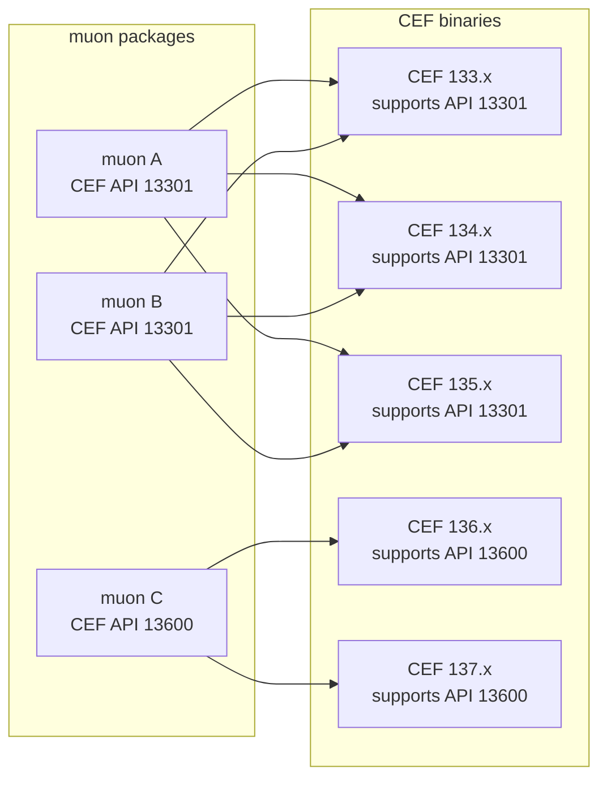

# CEF versions and CEF API versions (Advanced topics)

CEF has native API versioning.
Usually, this versioning has a "version window", and compatibility is maintained across several CEF versions.

The following is a conceptual diagram.
A given muon version uses a fixed CEF API version.
The range of multiple CEF binaries that support that CEF API version becomes the version window:

muon-core and the launch helper embed muon-core build information and CEF version information referenced by the muon binaries.
For policies other than `tested`, usable CEF versions are determined from this `cefReference`, the catalog file, and the API hash included in `include/cef_api_versions.h` inside candidate archives.
Information about the CEF loaded at runtime can be checked in `cefRuntime` from `muon.environments.getRuntimeInfo()`.

- Note: CEF API versions are intended for ABI compatibility, but compatibility of CEF feature behavior is not necessarily maintained.
  In other words, even if the API hash matches, differences in CEF browser behavior may still occur.
  For details on CEF API versioning, see the official CEF [API Versioning](https://chromiumembedded.github.io/cef/api_versioning.html) documentation.

`compat-latest` and `same-major-latest` check ABI compatibility, but they do not guarantee behavioral equivalence for Chromium/CEF browser features.
Validate the target CEF on the application side before distribution.
