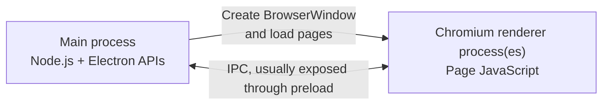
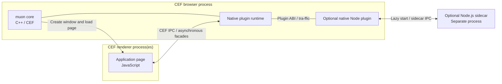

# Getting started with muon

Let's create an application with muon, a muon app.
It is very easy not only to create a new application, but also to turn an existing web application into a muon app.

To show this, start by preparing a very ordinary web application project.
For example, use a [Vite template](https://vite.dev/guide/) to create "my-muon-app":

```bash
npm create vite@latest my-muon-app -- --template react-ts
```

This example uses React + TypeScript, but of course other choices are fine.
Using TypeScript is recommended. The reason is explained later.

Install the required packages and run the application with the following commands:

```bash
cd my-muon-app
npm install
npm run dev
```

The Vite development server starts, and you can click the link to show the page in a browser.
muon has not been introduced yet. This is still a plain Vite project.

Now add muon to this project. The required work is only:

1. Install the muon package.
2. Configure the muon Vite plugin.

Both steps are very simple.

## Install the muon package

Install the muon package, officially named `muon-ui`, into `devDependencies`:

```bash
npm install -D muon-ui
```

The muon package includes the following:

- muon CLI
- muon Vite plugin
- TypeScript type definitions for muon built-in plugins
- Platform-specific muon binary assets

The CEF binary itself is not included in the NPM package.
CEF is downloaded from the official CDN when it becomes necessary.

## Configure the muon Vite plugin

Installing the muon package almost completes the preparation, but you should enable the muon Vite plugin so that HMR (Hot Module Replacement) and muon app builds are available.

For anyone unfamiliar with HMR, Vite acts as a development server, lets a browser show the page, and updates the display almost in real time when the page is edited.
In other words, it is a very useful feature that automatically previews edit results.

The muon Vite plugin supports HMR by launching muon instead of a browser and making HMR work inside the muon app.
Add the following code to `vite.config.ts` to enable it:

```ts
import { defineConfig } from 'vite'
import react from '@vitejs/plugin-react'
import muon from 'muon-ui/vite'

export default defineConfig({
  plugins: [
    react(),  // React plugin
    muon(),   // muon plugin (add this)
  ],
})
```

Add `muon()` to the `plugins` array in the `defineConfig()` argument.
This enables the muon Vite plugin. Preparation is now complete.

Launch muon:

```bash
npm run dev
```

The muon window and your page should appear.


Try changing the page source code and confirm that HMR works just as well as it did in the browser.
For example, change the `<h1>Get started</h1>` line in `src/App.tsx` to `<h1>Get started with muon!</h1>` and save it.
The display in the muon window should update immediately without restarting.

Clicking the "Count is 0" counter button in the center of the page should increase the count.
This confirms that React from the Vite template is working correctly.

If you click a button such as "Explore Vite", a new window opens and shows the following disappointing page:


This is exactly the evidence that muon's network-access whitelist filter is working.
The button tries to show the official Vite site (`https://vite.dev/`), but by default muon only permits access to local assets.
Content from other sites is blocked.
The way to configure this whitelist is explained in detail in another chapter.

You can also launch muon DevTools with the `F12` key:


CDP (Chrome DevTools Protocol) is also enabled, so you can control the app with Playwright or debug it with VS Code. See the relevant chapter for details.

You can recycle-restart muon with `Ctrl+F12`.
Recycle restart is useful when you changed something that HMR cannot apply, such as `muon.json`.

## Distribution builds

As your muon app implementation starts to take shape, you will probably want to know how to distribute it to users.
muon makes it easy to generate the files for distribution, but first you need to add the application name, credits, and other metadata.

Following NPM package conventions, write these values in `package.json` and muon will reflect them.
For example:

```json
{
  "name": "my-muon-app",
  "version": "0.1.0",
  "description": "First time muon app.",
  "files": [
    "README.md",
    "LICENSE",
    "dist"
  ],
  // :
  // :
}
```

This reflects the muon app name, version, and description.

When regular files are specified in `files`, files that satisfy the conditions are copied into the root of the distribution directory.
In the example above, `README.md` and `LICENSE` are included.
Paths resolved as asset sources, such as `dist`, are excluded from this additional copy.

After preparation, run `npm run build`.
This runs the normal Vite build and then generates the muon distribution directories.

```bash
npm run build
```

> Note: This is an alias for `vite build` defined in the `scripts` section of `package.json`.

The files output to Vite's `build.outDir` are collected into `assets.zip`.
By default, muon builds all supported targets and outputs them under the `dist-muon/` directory:

```text
dist-muon/
+-- linux-amd64/
|   +-- assets.zip
|   +-- :
|   +-- vite-project
+-- linux-arm64/
|   +-- assets.zip
|   +-- :
|   +-- vite-project
+-- linux-armhf/
|   +-- assets.zip
|   +-- :
|   +-- vite-project
+-- windows-amd64/
|   +-- assets.zip
|   +-- :
|   +-- vite-project.exe
+-- windows-i686/
    +-- assets.zip
    +-- :
    +-- vite-project.exe
```

If you want to specify build targets or the output location in detail, use the Vite plugin's `build` argument:

```ts
import { defineConfig } from 'vite';
import muon from 'muon-ui/vite';

export default defineConfig({
  plugins: [
    muon({
      build: {  // Build options
        targets: ['linux-amd64', 'windows-amd64'],
        iconPath: 'icons/app.png',
        distributionFiles: ['README.md', 'LICENSE'],
        linuxDesktop: {
          name: 'My App (linux)',
        },
        windowsResource: {
          productName: 'My App (windows)',
        }
      },
    }),
  ],
});
```

The target names that can be specified in `build.targets` are:

- Linux targets: `linux-amd64`, `linux-armhf`, `linux-arm64`
- Windows targets: `windows-i686`, `windows-amd64`

By default, the application executable name is generated from the `name` field in `package.json`.
For scoped package names, the scope is removed.
If you place a PNG image at `build.iconPath`, it is used as the muon app icon.
If `build.distributionFiles` is specified, it takes precedence over `package.json` `files`.
An empty array disables additional copying.
You can also add Linux-target-specific and Windows-target-specific settings as shown above.

## Package generation

muon can also generate distribution packages such as installers and archives.

If the distribution build described above is ready, just run the `muon pack` command:

```bash
npx muon pack
```

> Note: If you find this hard to remember, you can add a `pack` entry to `scripts` in `package.json`. I do :)

`muon pack` generates distribution directories using the same build sequence as `muon build`, then packages them into the requested formats.

- If a muon Vite plugin is present, it runs `vite build` and generates the muon app.
- If no muon Vite plugin is present, it does not run `vite build` and uses existing assets.

It then outputs the final distribution artifacts for each requested format to `artifacts/`.
Working files generated during package creation, such as the `deb` package tree and `nsis` `.nsi` scripts, are placed under `.muon/pack/`.

If no options are passed to `muon pack`, files for all targets are generated.
Examples:

```bash
npx muon pack --target windows
npx muon pack --target amd64
npx muon pack --type tgz
npx muon pack --type nsis
npx muon pack --target linux-amd64 --type tgz,deb 
npx muon pack --target windows-amd64 --type nsis
```

- Targets can be specified with `--target` or `--all`.
  When omitted, the Vite plugin `build` setting is used.
  If there is no muon Vite plugin or the setting is omitted, all supported targets become package candidates.
  In addition to complete target names, platform names `linux` and `windows`, and architecture names `amd64`, `arm64`, `armhf`, and `i686`, can also be specified.
- `--type` can specify `zip`, `tgz`, `tar.gz`, `deb`, and `nsis`, either comma-separated or as multiple options.
  When omitted, all of `zip`, `tgz`, `deb`, and `nsis` are targeted.
- `zip` is only available for Windows targets and creates a portable ZIP containing each `<packageName>/<target>` directory.
- `tgz` or `tar.gz` is only available for Linux targets and creates a portable gzip-compressed tar archive containing each `<packageName>/<target>` directory.
  `tgz` is an alias for `tar.gz`, and the output filename is always `*.tar.gz`.
  Portable distributions do not include CEF binaries. On first launch, CEF is prepared directly under the extracted `<packageName>/<target>` directory.
  The profile is also stored in `profile/` under the same directory.
- `deb` is only available for Linux targets and requires `dpkg-deb` on the runtime `PATH`.
  On Debian/Ubuntu, install it with `sudo apt install dpkg-deb`.
- `nsis` is only available for Windows targets and requires `makensis` on the runtime `PATH`.
  On Debian/Ubuntu, install it with `sudo apt install nsis`.
  On Windows, download it from [Nullsoft Scriptable Install System](https://nsis.sourceforge.io/Main_Page).
- Combinations unsupported by the requested format and target are skipped, and only valid combinations are generated.
  For example, `muon pack --type nsis` generates only NSIS packages for Windows targets and does not generate Linux targets.
- CLI options can be specified in the same way as `muon build` options such as `--icon`, `--windows-icon`, and `--linux-desktop-id`.
  `packageName`, `version`, `description`, and `author` use `package.json` as their defaults and can be overridden by CLI options.
- In `muon pack`, the value of `--package-version` is also used as the `package.json.version` fallback for the Windows resource version.
  For example, when applying a Git-derived version with [screw-up](https://github.com/kekyo/screw-up/), specify `npx muon pack --package-version "$(screw-up format -e '{version}')"`.

---

## A note on muon's architecture

By this point, you should understand the basics of implementing a muon app.
Some readers may already be familiar with Electron, so it is worth briefly explaining how their internal architectures differ.

The key difference is the entry point for developer-authored application code and the layer that manages the UI lifecycle.

- Electron inherits [Chromium's multi-process model](https://www.electronjs.org/docs/latest/tutorial/process-model).
  The developer-provided entry point runs in the main process, which has a Node.js environment. It creates `BrowserWindow` instances and loads pages into Chromium renderer processes.
  JavaScript in a page normally coordinates with the main process through IPC APIs exposed by a preload script.
- In muon, the C++ muon core initializes CEF.
  The CEF browser process manages the application lifecycle, windows, and native plugin runtime, while the primary entry point for developer-authored application code is the page loaded into a renderer process.
  Native plugin functions are exposed to the page as asynchronous APIs over CEF IPC, so the developer does not need to provide a Node.js main process.
- The native Node plugin in the browser process is enabled only when `node.project` is configured.
  The first `importModule()` lazily starts a separate Node.js sidecar process, and subsequent calls are relayed to it.
  The sidecar neither creates nor owns the UI; it is an option for offloading work or using functionality from the Node.js ecosystem.

Electron:



muon:



From a developer's perspective, the primary entry point of a muon app is the loaded page, so the same development techniques used for ordinary Vite or React web applications apply.
Internally, configuration, policies, the plugin runtime, and other components are initialized before the window is created, but the developer does not have to implement these steps as main-process JavaScript.
This page-centered model lets developers who know web development start building muon apps directly.

This does not mean that every operation must be placed in the renderer process.
When no separate backend is selected, domain logic and data repository implementations are also included in the page bundle, but responsibilities can be moved to native plugins, the [Node.js sidecar](./nodejs-sidecar.md), or a remote Web API when necessary.
The Node.js sidecar lets non-UI Node.js code be structured as an ordinary Node.js project in a separate process.

Before bundling a large backend implementation into a muon app, consider whether it should instead be implemented as a Web API hosted by a cloud service or virtual machine.
When a page accesses a Web API, allow only the required endpoints with [`network.allow`](./external-network.md), in addition to satisfying normal browser requirements such as CORS.
`network.allow` controls network requests made by pages through CEF; it does not apply to network access from inside the Node.js sidecar.
