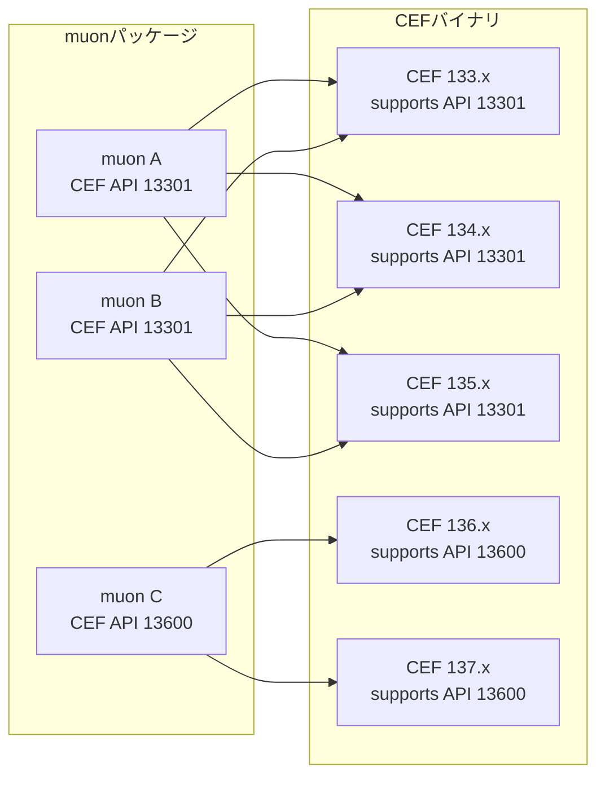

# CEFバージョンとCEF APIバージョン (Advanced topics)

CEFには、ネイティブAPIのバージョニングが存在します。通常、このバージョニングは「バージョンウインドウ」が存在し、CEFのいくつかのバージョンに渡って互換性が維持されます。

以下は概念図です。あるmuonバージョンは、固定されたCEF APIバージョンを使用します。
そして、そのCEF APIバージョンをサポートする複数のCEFバイナリの範囲が、バージョンウインドウになります:

muon-coreと起動ヘルパーには、muon-coreのビルド情報と、muonバイナリが参照するCEFバージョン情報が埋め込まれています。
`tested` 以外のpolicyでは、この `cefReference` とカタログファイル、さらに候補archive内の `include/cef_api_versions.h` に含まれるAPI hashから、使用可能なCEFバージョンを特定します。
実行中にロードされたCEFの情報は `muon.environments.getRuntimeInfo()` の `cefRuntime` で確認出来ます。

- 注意: CEF APIバージョンはABI互換を目的としていますが、CEF機能の挙動互換は必ずしも維持されない可能性があります。
  つまり、API hashが一致していても、CEFのブラウザ機能としての差異は発生するかもしれません。
  CEF APIバージョニングの詳細は、CEF公式の [API Versioning](https://chromiumembedded.github.io/cef/api_versioning.html) を参照して下さい。

`compat-latest` や `same-major-latest` はABI互換を確認しますが、Chromium/CEFのブラウザ機能としての挙動差までは保証しません。アプリケーション側で対象CEFの検証を行ってから配布して下さい。

