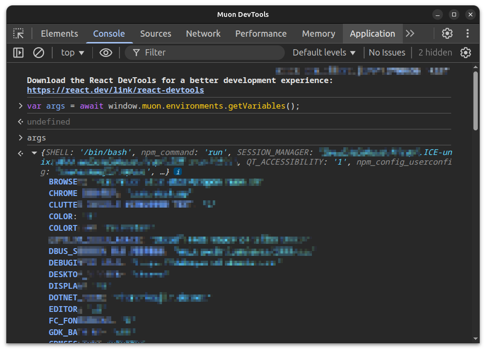
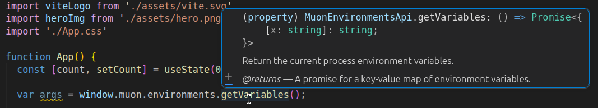

## muonプラグインを使用する

ここまでで、muonアプリを開発するための開発ライフサイクルを説明しましたが、
muonアプリがネイティブアプリケーションとして振る舞うためには、少し機能が足りません。

例えば、muonウインドウ自身の細かい制御・ローカルファイルの読み書き・プロセスの環境情報の参照・プロセス起動、などの操作は、標準的なブラウザのJavaScript環境では公開されていません。
muonはこのようなネイティブ機能へアクセスするための拡張可能なプラグイン構造を備えています。これを "muonプラグイン" と呼びます。

> 注釈: muon Viteプラグインのことではありません。

muonプラグインの基本的な機能は、muon内蔵プラグインが提供します。
また、muonプラグインAPIを実装してmuonにロードさせることで、内蔵プラグイン同様に機能を拡張することも出来ます。

以下の例では、muon内蔵プラグインを使用して、子プロセスを起動します。

```ts
// muon.executor名前空間のspawnを参照
import { spawn } from "muon:executor";

// spawn関数を使用
const child = await spawn({
  command: "ps",
  args: ["xw"],
});
const result = await child.wait();
```

「確かにこれは簡単だ、早速試してみよう！」と思っても、これはそのままでは動作しません。
理由は、すべてのmuonプラグインはホワイトリスト方式のフィルターで制御されるからです。

### muonプラグイン関数へのアクセス許可

まず、`muon.json` の `"plugin"` で、どのJavaScriptからどのプラグイン関数をインポートできるかを指定します。
muon Viteプラグインはこの設定を読み取り、muonプラグインへのアクセスを許可します:

```json
{
  "plugin": {
    "mode": "validate",
    "pages": ["asset://main/**"],
    "plugins": [
      {
        "name": "internal",
        "imports": [
          {
            "sources": ["src/native/**"],
            "allow": ["muon.executor.spawn"]
          }
        ]
      }
    ]
  }
}
```

- `mode` は、プラグインアクセスの方式を決定します。省略可能で、既定は `"validate"` です。
- `pages` は、muonプラグインへのアクセスを可能にするページのURLです。
  既定では、 `asset://main/**` にのみ許可されます。これ以外のページからは、muonプラグイン関数にアクセス出来ません。
- `name` は、プラグイン名です。内蔵プラグインに限り、特別な `"internal"` を使用します。
  その他のプラグインは、`plugins/` ディレクトリ内に配置されたプラグインファイル (`*.so`または`*.dll`) を読み込みますが、拡張子を除いたファイル名部分を `name` に指定します。
  `spawn()` は、`muon.executor` 名前空間に配置されている、muon内蔵プラグインによる関数です。
  これを呼び出し可能にするには、`name` に `"internal"`を、`imports[].allow` に `"muon.executor.spawn"` と指定します。
- `imports` で、 `sources` に指定したパスに一致するソースファイルからのみ、`allow` に指定したmuonプラグイン関数のインポート (TypeScript/JavaScriptの `import` による参照)を許可します。

次に、TypeScriptコンパイラに対して、型定義を参照できるようにします。
`tsconfig.json` で `compilerOptions.types` に対して、muonの型定義も明示的に加えて下さい:

```json
{
  "compilerOptions": {
    "types": [
      "vite/client",   // Viteの型定義
      "muon-ui"        // muon内蔵プラグインの型定義（追加する）
    ]
  }
}
```

これで、muon内蔵プラグインを使ってコードを実装することが出来るようになります。

上記の方法でmuonプラグインを参照することは `validate` モードと呼びます。
他には `simple` モードも存在します:

```json
{
  "plugin": {
    "mode": "simple",
    "pages": ["asset://main/**"],
    "plugins": [
      {
        "name": "internal",
        "allow": ["muon.executor.spawn"]
      }
    ]
  }
}
```

`simple` モードでは、 `window` オブジェクトから名前空間オブジェクトを辿ることで、muonプラグインの関数群にアクセス出来ます:

```javascript
// 子プロセスを起動する (simpleモード)
var child = await window.muon.executor.spawn({
  command: "ps",
  args: ["xw"],
});
var result = await child.wait();
```

この方法であれば、muon Viteプラグインによるビルドプロセスを適用する必要がありません。
muon DevToolsを開いてコンソールで直接試すことが出来ます:



|モード|Viteプラグイン|ページフィルタ|アクセス元フィルタ|詳細|
|:----|:----|:----|:----|:----|
|`validate`|必要|可能|可能|既定です。指定省略時はこのモードが使用されます。このモードは、muonプラグインの関数をインポートできるコードを、明示的に指定したソースファイルまたはNPMパッケージでフィルタすることが出来ます|
|`simple`|不要|可能|不可|このモードは、muonプラグインの名前空間オブジェクトと関数を `window` オブジェクト下に直接挿入します。単純ですが、 `validate` モードのように、参照元のコードからのアクセスでフィルタすることは出来ません|

> 注釈: muonでは `validate` モードを使用することを強く推奨します。
> 理由は、 `validate` モードであれば、muonプラグイン関数へのアクセスをホワイトリストフィルタで制限することが出来るからです。
> 例えば、muonプラグインの関数を呼び出せるのは、あなたが書いた `myfoobar.ts` ファイルと `foobar` NPMパッケージのみ、
> のように制限させることが出来て、その他のJavaScriptコードからmuonプラグイン関数を呼び出すことが難しくなります。
> これにより、NPMのサプライチェーン攻撃に対する耐性を向上させることが出来ます。

### muonプラグイン関数のシグネチャ

muonプラグインで公開されるすべての関数は、`Promise` を返却する関数として定義されていることに注意して下さい。
一般的に、 `Promise` を返す非同期関数の結果を得るには、 `await` する、と覚えておけば良いでしょう。

muonの内蔵プラグインから提供されるAPIは、 `muon.d.ts` によるTypeScriptの型定義が提供されています。
これはmuonプラグインをインストールした時点で参照可能となっているため、
TypeScriptを使用してコードを記述する場合は、 `muon:executor` などのvirtual moduleインポートや、`window.muon` 階層に対して型チェックによる恩恵を得られます:



> 注釈: すべてのプラグイン関数は、前節のホワイトリストで指定された関数のみが使用可能となります。
> しかし、`muon.d.ts` の型定義は、それらのAPIが存在するものと仮定して定義されているため、
> ホワイトリストへの指定が漏れていると実行時エラーとなることに注意が必要です。

---

